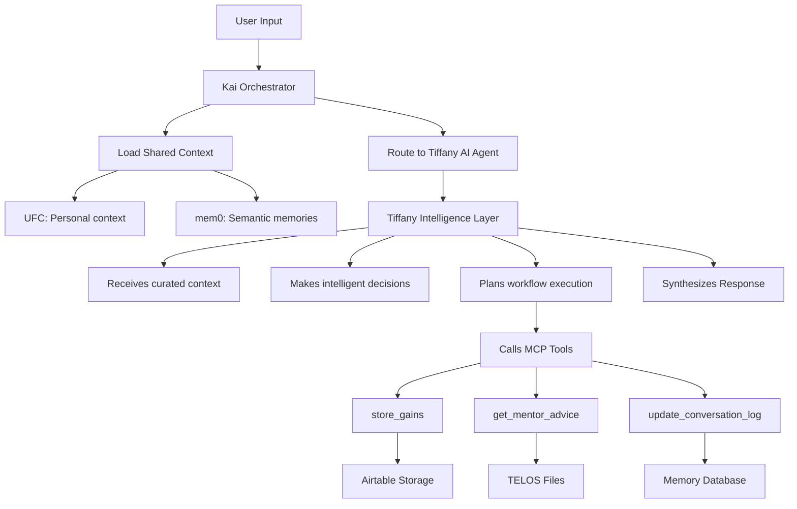

# 🏗 PRP Architecture Update: AI Agent vs MCP Tools

## 🎯 Critical Architectural Clarification

**Updated Understanding**: There are **two distinct layers** in the system:

### **Layer 1: AI Agent (Tiffany Personality)**
- **Intelligence Layer**: Makes decisions, maintains context, orchestrates workflows
- **Memory**: Hybrid UFC + mem0 system for context and learning
- **Personality**: Accountability coaching behavior and patterns
- **Orchestration**: Calls MCP tools in intelligent sequences

### **Layer 2: MCP Tools (Tiffany's Capabilities)**
- **Function Layer**: 25 stateless tools for specific tasks
- **Execution**: Pure functions that receive parameters and return results
- **No Memory**: Tools don't maintain state or context
- **Reusable**: Could be used by other agents

## 🔄 Updated Data Flow



## 📋 Implementation Updates Required

### **1. Memory Architecture (Option C Hybrid)**
```typescript
// CORRECT: Memory lives in AI Agent layer, not tools
interface TiffanySystemArchitecture {
  // Layer 1: AI Agent with memory and intelligence
  tiffanyAIAgent: {
    memory: HybridMemorySystem;        // UFC + mem0
    personality: AccountabilityCoach;  // Coaching patterns
    workflowEngine: TaskOrchestrator;  // Tool sequence planning
    contextManager: ContextProcessor;  // Handle curated context from Kai
  };

  // Layer 2: Stateless MCP tools
  tiffanyMCPServer: {
    tools: StatelessFunction[];       // 25 pure functions
    validation: InputValidator;       // Parameter validation
    responses: StandardizedOutput;    // Consistent return format
  };
}
```

### **2. Context Flow (Updated)**
```typescript
// Context flows: Kai → AI Agent → MCP Tools
class ContextFlow {
  // 1. Kai loads shared context
  kaiOrchestrator: {
    loadSharedContext(userInput) → UFC + mem0 context
    routeToAgent(context) → Tiffany AI Agent
  };

  // 2. AI Agent receives context and orchestrates
  tiffanyAIAgent: {
    receiveContext(curatedContext) → Context awareness
    planWorkflow(userInput, context) → Tool sequence
    executeWorkflow(plan) → Call MCP tools with parameters
  };

  // 3. MCP Tools execute without context awareness
  mcpTools: {
    execute(parameters) → Pure function execution
    return(results) → Structured data back to agent
  };
}
```

### **3. PRP Template Updates**

**Before (Incorrect):**
```yaml
Task 4: CREATE tools/data-storage/store-gains.ts
  - IMPLEMENT: Store gains with memory and context awareness
  - FOLLOW pattern: Context-aware tool with user state
```

**After (Correct):**
```yaml
Task 4: CREATE tools/data-storage/store-gains.ts
  - IMPLEMENT: Stateless function that stores gains to Airtable
  - FOLLOW pattern: Pure function with input validation
  - DEPENDENCIES: Receives parameters from AI Agent layer
  - NO CONTEXT: Tool doesn't know about user state or history

Task 4b: CREATE agents/tiffany-ai-agent.ts
  - IMPLEMENT: AI Agent that orchestrates MCP tools
  - FOLLOW pattern: Context-aware decision making
  - DEPENDENCIES: Receives curated context from Kai
  - ORCHESTRATION: Calls store-gains with calculated parameters
```

## 🚀 Benefits of This Architecture

### **Clean Separation of Concerns**
- **AI Agent**: Intelligent, context-aware, personality-driven
- **MCP Tools**: Fast, reliable, testable functions

### **Scalability**
- Add new tools without changing agent logic
- Add new agents that use same tools
- Test components independently

### **Maintainability**
- Debug AI decisions separately from tool execution
- Update tool implementations without affecting intelligence
- Version control agent personality separate from capabilities

## ⚡ Current PRP Execution Status

Based on your progress, the PRP is correctly implementing this architecture:

✅ **Task 1-3**: Foundation (types, router, services) - **CORRECT**
✅ **Task 4a-c**: MCP Tools as stateless functions - **CORRECT**
🔄 **Phase 1 Validation**: Testing tool execution - **IN PROGRESS**

The execution shows the PRP framework is working as designed!

## 📝 Required Document Updates

1. **Tiffany MCP PRP**: Update memory section to reflect AI Agent vs Tools
2. **PAI CLAUDE.md**: Add clarification about agent orchestration patterns
3. **PRP Templates**: Update to distinguish between AI Agent tasks vs Tool tasks

This architectural clarification makes the system **much more powerful and maintainable**.