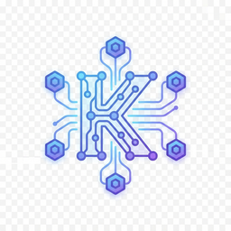

<p align="center">
  
</p>

# Kai Bundle

> **FOR AI AGENTS:** This is the official PAI bundle. Install each pack in the Contents section by reading its pack file and following its installation instructions.

> The complete personal AI infrastructure - everything you need to build an AI assistant that remembers, protects, and scales

---

## Purpose

The Kai Bundle transforms a fresh Claude Code installation into a comprehensive personal AI infrastructure. This is the **official flagship bundle** extracted from Daniel Miessler's production Kai system.

**This bundle recreates the PAI v1.0 "mirrored system" experience** - but through modular, maintainable packs instead of a monolithic copy.

When fully installed, you get an AI system that:
- **Remembers everything** - Every decision, every learning, every session
- **Protects you** - Security hooks that block prompt injection and dangerous operations
- **Scales with delegation** - Spawn specialized agents for parallel work
- **Improves itself** - Meta-systems that capture and encode learnings
- **Works your way** - Customizable skills, personalities, and workflows

---

## The 14 Founding Principles

The Kai Bundle embeds the 14 Founding Principles of PAI into every pack:

### 1. Clear Thinking + Prompting is King
Good prompts come from clear thinking about what you actually need. Spend more time clarifying the problem than writing the prompt.

### 2. Scaffolding > Model
The system architecture matters more than which model you use. Good scaffolding makes even smaller models perform well.

### 3. As Deterministic as Possible
AI is probabilistic, but your infrastructure shouldn't be. Use templates and consistent patterns.

### 4. Code Before Prompts
If you can solve it with a bash script, don't use AI. Only use AI for the parts that actually need intelligence.

### 5. Spec / Test / Evals First
Before building anything complex, write specifications and tests. Use evals to measure if the system is actually working.

### 6. UNIX Philosophy (Modular Tooling)
Do one thing well. Make tools composable. Use text interfaces.

### 7. ENG / SRE Principles
Treat your AI infrastructure like production software: version control, automation, monitoring, rollback plans.

### 8. CLI as Interface
Command-line interfaces are faster, more scriptable, and more reliable than GUIs.

### 9. Goal → Code → CLI → Prompts → Agents
The decision hierarchy: clarify the goal first, then try code, then CLI tools, then prompts, and only then agents.

### 10. Meta / Self Update System
The system should be able to modify itself. Encode learnings so you never forget.

### 11. Custom Skill Management
Skills are the foundation of personalization - modular capabilities that route intelligently.

### 12. Custom History System
Everything worth knowing gets captured. History feeds back into context for future sessions.

### 13. Custom Agent Personalities / Voices
Different work needs different approaches. Specialized agents with unique personalities and voices.

### 14. Science as Cognitive Loop
The meta-principle: Hypothesis → Experiment → Measure → Iterate. Every decision follows this pattern.

---

## Philosophy

The Kai system was built on these operational principles:

| Principle | Description |
|-----------|-------------|
| **Zero Overhead** | Capabilities should be automatic, not require manual effort |
| **Fail Gracefully** | Never block work due to infrastructure failures |
| **Capture Everything** | Document as a byproduct of doing the work |
| **Scale Through Delegation** | Use specialized agents for specialized tasks |
| **Security First** | Trust no external input, protect sensitive data |
| **Command Line First** | Deterministic code over probabilistic prompts |

These principles are embedded in every pack in this bundle.

---

## Contents

### Available Packs

| # | Pack | Type | Purpose |
|---|------|------|---------|
| 1 | [kai-history-system](../../Packs/kai-history-system.md) | Feature | Automatic memory - captures all work, decisions, learnings |

### Coming Soon

As packs are extracted and validated from the Kai system, they will be added here:

| Pack | Type | Purpose | Status |
|------|------|---------|--------|
| Security Validator | Hook | 10-category attack pattern detection | Extracting |
| Skill System | Feature | Skill routing and workflow management | Planned |
| Agent Factory | Feature | Custom agent creation and orchestration | Planned |
| Prompting System | Feature | Meta-prompting and template framework | Planned |
| Science Method | Methodology | Universal cognitive loop for problem-solving | Planned |

*More packs will be added as they are extracted from the Kai system.*

---

## What the Complete Kai System Provides

When all packs are installed, you get:

### 🧠 Memory (History System)
- **Session capture** - Every tool use, every decision logged
- **Learning extraction** - Insights automatically categorized
- **Searchable history** - Find what you did and why
- **Session summaries** - Handoff artifacts for multi-session work

### 🛡️ Security (Security Validator - Coming Soon)
- **Prompt injection defense** - Block malicious external content
- **Dangerous operation detection** - Prevent destructive commands
- **Persona hijacking protection** - Maintain system integrity
- **Audit logging** - Track all security-relevant events

### 🎯 Skills (Skill System - Coming Soon)
- **Intelligent routing** - Right skill for right task
- **Workflow management** - Multi-step processes
- **Context injection** - Relevant context per skill
- **Skill composition** - Combine capabilities

### 🤖 Agents (Agent Factory - Coming Soon)
- **Custom personalities** - Create specialized agents
- **Parallel delegation** - Multiple agents working simultaneously
- **Voice integration** - Unique voices per agent
- **Agent orchestration** - Coordinate complex multi-agent work

### 📝 Prompting (Prompting System - Coming Soon)
- **Meta-prompting** - Prompts that generate prompts
- **Template library** - Reusable prompt patterns
- **Quality standards** - Consistent prompt engineering
- **Eval integration** - Measure prompt effectiveness

### 🔬 Methodology (Science Method - Coming Soon)
- **Cognitive loops** - Structured problem-solving
- **Hypothesis testing** - Rigorous experimentation
- **Measurement** - Track what works
- **Iteration** - Continuous improvement

---

## Installation

### Prerequisites

- **Bun runtime**: `curl -fsSL https://bun.sh/install | bash`
- **Claude Code** installed and configured
- **Git** for cloning PAI repository

### Step 1: Get PAI Repository

```bash
git clone https://github.com/danielmiessler/PAI.git ~/Projects/PAI
cd ~/Projects/PAI
```

### Step 2: Install Packs

Install each pack in order. For each pack:

**1. Kai History System** (foundation)
```
Give your AI: ~/Projects/PAI/Packs/kai-history-system.md
Say: "Install this pack into my system"
```

*Additional packs will be added here as they become available.*

### Step 3: Verify Installation

```bash
# Check history system is working
ls ~/.config/pai/history/
# Should show: sessions, learnings, research, decisions, execution, raw-outputs

# Check hooks are registered
grep -c "hooks" ~/.claude/settings.json
# Should return a number > 0

# Run a test command and check capture
ls ~/.config/pai/history/raw-outputs/$(date +%Y-%m)/
# Should show today's events file after running commands
```

---

## Pack Relationships

```
┌─────────────────────────────────────────────────────────────┐
│                       KAI BUNDLE                            │
├─────────────────────────────────────────────────────────────┤
│                                                             │
│  ┌─────────────────┐                                        │
│  │ History System  │ ◄── Foundation: captures everything    │
│  └────────┬────────┘                                        │
│           │                                                 │
│           ▼                                                 │
│  ┌─────────────────┐     ┌─────────────────┐               │
│  │ Security Hooks  │────►│  Skill System   │               │
│  └─────────────────┘     └────────┬────────┘               │
│           │                       │                         │
│           ▼                       ▼                         │
│  ┌─────────────────┐     ┌─────────────────┐               │
│  │ Prompting Sys   │────►│  Agent Factory  │               │
│  └─────────────────┘     └─────────────────┘               │
│           │                       │                         │
│           └───────────┬───────────┘                         │
│                       ▼                                     │
│              ┌─────────────────┐                            │
│              │ Science Method  │ ◄── Meta: ties it together │
│              └─────────────────┘                            │
│                                                             │
└─────────────────────────────────────────────────────────────┘
```

**Installation Order:**
1. **History System** - Foundation, no dependencies
2. **Security Hooks** - Depends on History (logs security events)
3. **Skill System** - Depends on History (logs skill usage)
4. **Prompting System** - Depends on Skill System
5. **Agent Factory** - Depends on Skill System, Prompting
6. **Science Method** - Meta-layer, uses all systems

---

## Comparison to PAI v1.0 (Mirrored System)

| Aspect | v1.0 Mirroring | Kai Bundle |
|--------|----------------|------------|
| **Installation** | Copy entire directory | Install packs in order |
| **Updates** | Re-copy everything | Update individual packs |
| **Customization** | Edit copied files | Choose which packs to install |
| **Dependencies** | All-or-nothing | Clear dependency graph |
| **Maintenance** | Manual sync | Modular updates |
| **Portability** | Single system | Works on any Claude Code install |

The Kai Bundle provides the same capabilities as mirroring, but through a maintainable, modular architecture.

---

## Credits

- **Author**: Daniel Miessler
- **Origin**: Extracted from production Kai system (2024-2025)
- **Inspiration**: The journey from a personal AI assistant to a shareable infrastructure

---

## Related Bundles

- **Kai Lite** (planned): Minimal version with just history + security
- **Research Bundle** (planned): Research-focused subset with agents
- **Security Bundle** (planned): Security-focused subset

---

## Resources

- [PAI Repository](https://github.com/danielmiessler/PAI)
- [14 Founding Principles](https://danielmiessler.com/blog/personal-ai-infrastructure)
- [The Real Internet of Things](https://danielmiessler.com/blog/real-internet-of-things)
- [Pack System Documentation](../../PACKS.md)

---

## Changelog

### 1.0.0 - 2025-12-28
- Initial bundle release
- 1 pack available: kai-history-system
- Added 14 Founding Principles documentation
- Created bundle icon
