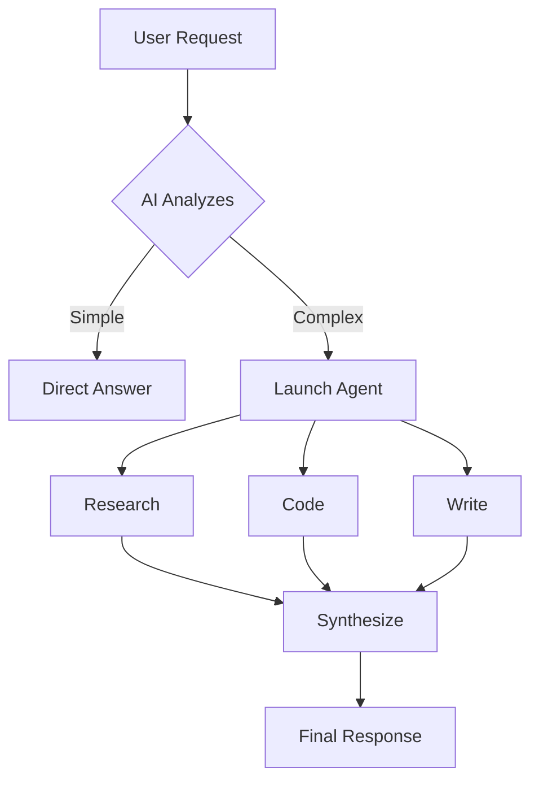

# Art Pack v1.0.0

**Complete visual content system for creating charcoal architectural sketch imagery**

---

## 🤖 Assistant Install Prompt

**For AI Assistants: When your user asks you to install this pack, follow these steps:**

```
ASSISTANT INSTALLATION INSTRUCTIONS

1. READ this entire pack file to understand what you're installing

2. EXPLAIN to the user:
   - What this pack does (visual content generation with charcoal sketch aesthetic)
   - What dependencies are required (bun, ImageMagick, WebP tools)
   - What API keys they'll need (at least one: Replicate, Google, or OpenAI)
   - Ask if they want to proceed

3. VERIFY dependencies:
   - Check if bun is installed (run: which bun)
   - Check if ImageMagick is installed (run: which magick)
   - Check if WebP tools are installed (run: which cwebp)
   - If missing, provide installation commands for their platform

4. SET UP API keys:
   - Check if ~/.claude/.env exists (or equivalent for their system)
   - Prompt user for required API keys
   - Add keys to environment file

5. SAVE the tools:
   - Create directory: ~/.claude/Skills/Art/Tools/ (or equivalent)
   - Extract the Generate.ts code from this pack (line 422-633)
   - Save to: ~/.claude/Skills/Art/Tools/Generate.ts
   - Make executable if needed

6. CONFIGURE skill routing (if user has a skill system):
   - Add Art skill routing to their CORE/routing configuration
   - Use the skill definition from this pack (lines 123-161)

7. TEST the installation:
   - Run the smoke test from this pack (lines 922-952)
   - Verify outputs are created correctly
   - Show user the test results

8. REPORT completion:
   - Summarize what was installed
   - Show the user how to use it (basic command example)
   - Mention where to find full documentation (this pack file)

If you encounter errors at any step, stop and report the issue to the user.
Don't proceed until the issue is resolved.
```

---

## Pack Metadata

```yaml
pack:
  name: Art
  version: 1.0.0
  category: visual-content
  author: Daniel Miessler
  license: MIT

  requires:
    - CORE >= 1.0.0 (for agent personalities, aesthetic guidelines)
    - Claude Code or compatible AI assistant platform

  platforms:
    - macos
    - linux
    - windows (with WSL for some tools)

  dependencies:
    tools:
      - bun (JavaScript runtime)
      - ImageMagick (image optimization)
      - WebP tools (cwebp command)

    api_keys:
      - REPLICATE_API_TOKEN (for Flux models)
      - OPENAI_API_KEY (for GPT-image-1)
      - GOOGLE_API_KEY (for Nano Banana Pro/Gemini)
      - REMOVEBG_API_KEY (for background removal)
```

---

## The Problem

Creating consistent, brand-aligned visual content at scale is challenging:

1. **Generic AI imagery** - Most AI-generated images look obviously synthetic, cookie-cutter, or corporate stock photo quality
2. **Inconsistent aesthetic** - Without strict guidelines, each image has different style, color palette, emotional register
3. **Manual workflow friction** - Generating, optimizing, and deploying images requires multiple tools and manual steps
4. **No narrative alignment** - Images don't capture the actual argument/story of the content they're illustrating
5. **Web performance** - Raw AI-generated images are 7-8MB, far too large for web use

---

## The Solution

The Art Pack provides a complete workflow for generating distinctive **charcoal architectural sketch** imagery with:

- **Consistent aesthetic** - Monumental emotional spaces, gestural charcoal linework, color washes, production design quality
- **Narrative-driven composition** - Uses story analysis (CSE-24) to extract the core problem/argument before designing visuals
- **Automated optimization** - Generates images in Downloads for preview, then auto-optimizes (resize, WebP conversion, thumbnails)
- **Multi-model support** - Flux 1.1 Pro, Nano Banana, Nano Banana Pro (Gemini), GPT-image-1 with smart model selection
- **Production-ready output** - Transparent backgrounds, social media thumbnails, optimized file sizes (90-95% reduction)

**Key differentiator:** Images are designed to show the *problem the content addresses*, not just illustrate the topic.

---

## Quick Start

### 1. Install Dependencies

```bash
# Install bun (if not already installed)
curl -fsSL https://bun.sh/install | bash

# Install ImageMagick
brew install imagemagick  # macOS
# OR
sudo apt-get install imagemagick  # Linux

# Install WebP tools
brew install webp  # macOS
# OR
sudo apt-get install webp  # Linux
```

### 2. Set Up API Keys

Add to your `~/.claude/.env` or equivalent:

```bash
# At least ONE model API key required
REPLICATE_API_TOKEN=your_token_here      # For Flux, Nano Banana
OPENAI_API_KEY=your_key_here             # For GPT-image-1
GOOGLE_API_KEY=your_key_here             # For Nano Banana Pro (Gemini)

# Optional but recommended
REMOVEBG_API_KEY=your_key_here           # For transparent backgrounds
```

### 3. Create Your First Image

Save the `Generate.ts` tool (see Tools section below) to a directory, then:

```bash
# Generate a blog header image (recommended workflow)
bun run Generate.ts \
  --model nano-banana-pro \
  --prompt "Sophisticated charcoal sketch showing a balance scale tipped heavily toward capital (deep purple wash) overwhelming labor (burnt sienna)..." \
  --size 2K \
  --aspect-ratio 1:1 \
  --thumbnail \
  --output ~/Downloads/capital-vs-labor.png

# This creates BOTH:
# - capital-vs-labor.png (transparent background)
# - capital-vs-labor-thumb.png (#EAE9DF background for social media)
```

---

## Pack Contents

### Skill Definition

When integrated into a Personal AI system, this skill routes visual content requests to appropriate workflows:

```yaml
name: Art
description: Complete visual content system for Unsupervised Learning. USE WHEN user wants to create visual content, illustrations, diagrams, OR mentions art, header images, visualizations, mermaid, flowchart, technical diagram, or infographic.

trigger_phrases:
  - "create art"
  - "generate image"
  - "make a diagram"
  - "header image"
  - "blog header"
  - "visualization"
  - "illustrate this"
  - "mermaid diagram"
  - "technical diagram"
  - "flowchart"
  - "infographic"

routing:
  - pattern: "blog header|editorial illustration|essay image"
    workflow: Essay
  - pattern: "mermaid|flowchart|sequence diagram"
    workflow: Mermaid
  - pattern: "technical diagram|architecture diagram|system diagram"
    workflow: TechnicalDiagrams
  - pattern: "taxonomy|classification|grid"
    workflow: Taxonomies
  - pattern: "timeline|chronological|progression"
    workflow: Timelines
  - pattern: "framework|2x2|matrix"
    workflow: Frameworks
  - pattern: "comparison|versus|vs"
    workflow: Comparisons
  - pattern: "stats|metrics|big number"
    workflow: Stats
```

---

### Workflows

#### Essay Workflow - Blog Header Generation

**Purpose:** Generate sophisticated blog header images that visually represent the *problem* the content addresses

**Key Innovation:** Runs story analysis (CSE-24) FIRST to extract the narrative core, then designs composition to show the problem

**Process:**

```markdown
# 8-Step Mandatory Workflow

1. UNDERSTAND - Deeply read and comprehend the content
   - What is the content about (not surface-level)?
   - What are key concrete elements (nouns, metaphors)?
   - Did user provide compositional guidance?

2. CSE-24 - Run Create Story Explanation (24 items)
   - Extract full narrative arc
   - Identify key metaphors and emotional beats
   - Understand what the piece is REALLY about

3. EMOTION - Match to emotional register
   - Dread/Fear, Hope/Possibility, Contemplation, etc.
   - Select from aesthetic vocabulary

4. COMPOSITION - Design what to ACTUALLY DRAW

   🚨 CRITICAL: Identify the PROBLEM TYPE first

   Problem Archetypes:
   - SORTING/CLASSIFICATION → scattered items + empty labeled bins
   - COMMUNICATION → tangled speech, broken telephone
   - DOUBLE STANDARD → tilted scales, unfair judges
   - MISDIRECTION → looking left while danger is right
   - OVERWHELM → flood of items, buried figure
   - MISSING FRAMEWORK → chaos vs empty scaffolding
   - FALSE DICHOTOMY → two doors, hidden third path
   - COMPLEXITY → tangled vs straight path
   - BLINDSPOT → figure ignoring elephant

   Design Questions:
   - What is the PROBLEM the essay addresses?
   - What visual metaphor makes this problem OBVIOUS?
   - What concrete subjects from content should appear?
   - Should there be figures showing the problematic dynamic?

5. PROMPT - Construct using charcoal sketch TECHNIQUE template

   Template Structure:
   ```
   Sophisticated charcoal sketch using architectural rendering TECHNIQUE.

   THE PROBLEM THIS ESSAY ADDRESSES:
   [The unfairness/mistake/confusion the essay critiques]

   SUBJECT (showing the problem):
   [Visual subject that makes the problem visible]

   EMOTIONAL REGISTER: [From Step 3]

   TECHNIQUE - GESTURAL ARCHITECTURAL SKETCH:
   - GESTURAL quick confident energetic marks
   - OVERLAPPING LINES multiple strokes suggesting form
   - HATCHING cross-hatching creates depth and tone
   - Loose charcoal/graphite strokes
   - Variable line weight, trailing off
   - Like Paul Rudolph, Lebbeus Woods sketches

   HUMAN FIGURES (if present):
   - Multiple overlapping lines suggesting form
   - 20-40 overlapping strokes per figure
   - Abstracted but with PRESENCE and WEIGHT
   - Burnt Sienna (#8B4513) wash accent

   COMPOSITION - FULL FRAME MANDATORY:
   - Subjects FILL THE ENTIRE FRAME edge to edge
   - MINIMALIST - few elements, each intentional
   - NO filled backgrounds - floats in empty space

   COLOR - CHARCOAL DOMINANT:
   - 70-80% charcoal and gray
   - BURNT SIENNA (#8B4513) on human/warm elements (MANDATORY)
   - DEEP PURPLE (#4A148C) on tech/capital/cold elements (MANDATORY)
   - Colors integrated into forms, not splattered

   Sign "Kai" in small cursive charcoal - bottom right corner only.
   NO other text.
   ```

6. GENERATE - Execute CLI tool

   ```bash
   bun run Generate.ts \
     --model nano-banana-pro \
     --prompt "[PROMPT FROM STEP 5]" \
     --size 2K \
     --aspect-ratio 1:1 \
     --thumbnail \
     --output ~/Downloads/[descriptive-name].png
   ```

7. OPTIMIZE - Resize and convert to WebP

   ```bash
   # Resize to 1024x1024 for web
   magick "~/Downloads/[name].png" -resize 1024x1024 "~/Downloads/[name]-1024.png"

   # Convert to WebP (main display)
   cwebp -q 75 "~/Downloads/[name]-1024.png" -o "~/Downloads/[name].webp"

   # Optimize thumbnail for social media
   magick "~/Downloads/[name]-thumb.png" -resize 512x512 -quality 80 "~/Downloads/[name]-thumb-optimized.png"

   # Clean up temp file
   rm "~/Downloads/[name]-1024.png"
   ```

   Expected Results:
   - Original PNG: ~7.5MB → WebP: ~400KB (95% reduction)
   - Thumbnail: ~6.8MB → Optimized: ~500KB (93% reduction)

8. VALIDATE - Critical analysis before accepting

   🚨 MANDATORY CHECKS (regenerate if ANY fail):

   - Kai signature present (bottom right corner, just "Kai")
   - Problem type immediately visible
   - Subject matches content (not defaulted to architecture)
   - Title test passes (could guess topic from image alone)
   - Physics check (scales tip correctly, heavy things fall DOWN)
   - Logical consistency (if "X winning", X looks dominant)
   - BOTH burnt sienna AND deep purple present
   - Charcoal sketch technique (gestural, hatching, overlapping lines)
   - Subjects FILL FRAME (no 20%+ empty margins)
   - Background removed (transparent)
   - Gallery-worthy sophistication
```

**Output Files:**
- `[name].png` - Transparent background (inline blog image)
- `[name]-thumb.png` - #EAE9DF background (social media thumbnails)
- `[name].webp` - Optimized WebP (main display version)
- `[name]-thumb-optimized.png` - Optimized thumbnail

---

#### Mermaid Workflow - Flowchart Generation

**Purpose:** Generate Mermaid.js flowcharts and sequence diagrams as code

**When to use:** User asks for flowcharts, sequence diagrams, process flows, state machines

**Process:**

1. **Understand the flow** - What process/sequence needs visualization?
2. **Identify diagram type:**
   - Flowchart (`graph TD` or `graph LR`)
   - Sequence diagram (`sequenceDiagram`)
   - State diagram (`stateDiagram-v2`)
   - Class diagram (`classDiagram`)
3. **Generate Mermaid code** - Following Mermaid.js syntax
4. **Validate syntax** - Ensure proper node IDs, connections, styling
5. **Output as code block** - User can render in their environment

**Example Output:**



---

#### TechnicalDiagrams Workflow - Architecture Diagrams

**Purpose:** Generate technical architecture diagrams in charcoal sketch style

**Use cases:**
- System architecture
- Data flows
- Component relationships
- Network diagrams
- API structures

**Approach:**
- Uses same charcoal sketch aesthetic as Essay workflow
- Focuses on boxes, arrows, layers, connections
- Labels are clear and readable
- Purple for tech/systems, sienna for human touchpoints

**Example prompt pattern:**

```
Sophisticated charcoal architectural sketch showing a technical system architecture.

SUBJECT: Three-tier web application architecture
- Top layer: Frontend (React) - purple wash
- Middle layer: API Gateway - light gray
- Bottom layer: Database cluster - purple wash
- Arrows showing data flow between layers

TECHNIQUE - ARCHITECTURAL SKETCH:
- Clean rectangular boxes with gestural edges
- Hatching within boxes to show density/activity
- Arrows with varied line weight
- Labels in clean sans-serif
- Connection points clearly marked

COMPOSITION:
- Vertical flow, top to bottom
- Clear hierarchy and separation
- Full frame usage
- Minimal empty space

Sign "Kai" bottom right.
```

---

#### Other Workflows (Summary)

| Workflow | Purpose | Key Features |
|----------|---------|--------------|
| **Visualize** | General-purpose visualization router | Analyzes request, routes to appropriate workflow |
| **Taxonomies** | Classification grids, category systems | Grid layouts, labeled sections |
| **Timelines** | Chronological progressions | Linear flow, dated markers |
| **Frameworks** | 2x2 matrices, conceptual frameworks | Quadrants, axes, positioning |
| **Comparisons** | X vs Y visualizations | Side-by-side, contrasts |
| **Stats** | Big number displays, metric cards | Large numerals, context |
| **Comics** | Sequential panels, narratives | Panel layout, progression |
| **Maps** | Conceptual territories | Regions, boundaries, landmarks |
| **Aphorisms** | Quote cards, wisdom snippets | Typography focus, minimal |

All workflows follow the same core principles: charcoal sketch technique, burnt sienna + deep purple colors, problem-focused composition, full-frame usage.

---

### Tools

#### Generate.ts - Primary Image Generation CLI

**Purpose:** Generate images using multiple AI models with automatic optimization

**Full TypeScript Code:**

```typescript
#!/usr/bin/env bun

/**
 * generate - UL Image Generation CLI
 *
 * Generate Unsupervised Learning branded images using Flux 1.1 Pro, Nano Banana, Nano Banana Pro, or GPT-image-1.
 * Follows llcli pattern for deterministic, composable CLI design.
 *
 * Usage:
 *   generate --model nano-banana-pro --prompt "..." --size 16:9 --output /tmp/image.png
 *
 * @see ~/.claude/Skills/art/README.md
 */

import Replicate from "replicate";
import OpenAI from "openai";
import { GoogleGenAI } from "@google/genai";
import { writeFile, readFile } from "node:fs/promises";
import { extname, resolve } from "node:path";

// ============================================================================
// Environment Loading
// ============================================================================

/**
 * Load environment variables from ~/.claude/.env
 * This ensures API keys are available regardless of how the CLI is invoked
 */
async function loadEnv(): Promise<void> {
  const envPath = resolve(process.env.HOME!, '.claude/.env');
  try {
    const envContent = await readFile(envPath, 'utf-8');
    for (const line of envContent.split('\n')) {
      const trimmed = line.trim();
      if (!trimmed || trimmed.startsWith('#')) continue;
      const eqIndex = trimmed.indexOf('=');
      if (eqIndex === -1) continue;
      const key = trimmed.slice(0, eqIndex).trim();
      let value = trimmed.slice(eqIndex + 1).trim();
      // Remove surrounding quotes if present
      if ((value.startsWith('"') && value.endsWith('"')) ||
          (value.startsWith("'") && value.endsWith("'"))) {
        value = value.slice(1, -1);
      }
      // Only set if not already defined (allow overrides from shell)
      if (!process.env[key]) {
        process.env[key] = value;
      }
    }
  } catch (error) {
    // Silently continue if .env doesn't exist - rely on shell env vars
  }
}

// ============================================================================
// Types
// ============================================================================

type Model = "flux" | "nano-banana" | "nano-banana-pro" | "gpt-image-1";
type ReplicateSize = "1:1" | "16:9" | "3:2" | "2:3" | "3:4" | "4:3" | "4:5" | "5:4" | "9:16" | "21:9";
type OpenAISize = "1024x1024" | "1536x1024" | "1024x1536";
type GeminiSize = "1K" | "2K" | "4K";
type Size = ReplicateSize | OpenAISize | GeminiSize;

interface CLIArgs {
  model: Model;
  prompt: string;
  size: Size;
  output: string;
  creativeVariations?: number;
  aspectRatio?: ReplicateSize; // For Gemini models
  transparent?: boolean; // Enable transparent background
  referenceImage?: string; // Reference image path (Nano Banana Pro only)
  removeBg?: boolean; // Remove background after generation using remove.bg API
  addBg?: string; // Add background color (hex) to transparent image
  thumbnail?: boolean; // Generate additional thumbnail with #EAE9DF background for social previews
}

// ============================================================================
// Configuration
// ============================================================================

const DEFAULTS = {
  model: "flux" as Model,
  size: "16:9" as Size,
  output: `${process.env.HOME}/Downloads/ul-image.png`,
};

const REPLICATE_SIZES: ReplicateSize[] = ["1:1", "16:9", "3:2", "2:3", "3:4", "4:3", "4:5", "5:4", "9:16", "21:9"];
const OPENAI_SIZES: OpenAISize[] = ["1024x1024", "1536x1024", "1024x1536"];
const GEMINI_SIZES: GeminiSize[] = ["1K", "2K", "4K"];

// Aspect ratio mapping for Gemini (used with image size like 2K)
const GEMINI_ASPECT_RATIOS: ReplicateSize[] = ["1:1", "2:3", "3:2", "3:4", "4:3", "4:5", "5:4", "9:16", "16:9", "21:9"];

// ============================================================================
// Error Handling
// ============================================================================

class CLIError extends Error {
  constructor(message: string, public exitCode: number = 1) {
    super(message);
    this.name = "CLIError";
  }
}

function handleError(error: unknown): never {
  if (error instanceof CLIError) {
    console.error(`❌ Error: ${error.message}`);
    process.exit(error.exitCode);
  }

  if (error instanceof Error) {
    console.error(`❌ Unexpected error: ${error.message}`);
    console.error(error.stack);
    process.exit(1);
  }

  console.error(`❌ Unknown error:`, error);
  process.exit(1);
}

// ============================================================================
// Help Text
// ============================================================================

function showHelp(): void {
  console.log(\`
generate - UL Image Generation CLI

Generate Unsupervised Learning branded images using Flux 1.1 Pro, Nano Banana, or GPT-image-1.

USAGE:
  generate --model <model> --prompt "<prompt>" [OPTIONS]

REQUIRED:
  --model <model>      Model to use: flux, nano-banana, nano-banana-pro, gpt-image-1
  --prompt <text>      Image generation prompt (quote if contains spaces)

OPTIONS:
  --size <size>              Image size/aspect ratio (default: 16:9)
                             Replicate (flux, nano-banana): 1:1, 16:9, 3:2, 2:3, 3:4, 4:3, 4:5, 5:4, 9:16, 21:9
                             OpenAI (gpt-image-1): 1024x1024, 1536x1024, 1024x1536
                             Gemini (nano-banana-pro): 1K, 2K, 4K (resolution); aspect ratio inferred from context or defaults to 16:9
  --aspect-ratio <ratio>     Aspect ratio for Gemini nano-banana-pro (default: 16:9)
                             Options: 1:1, 2:3, 3:2, 3:4, 4:3, 4:5, 5:4, 9:16, 16:9, 21:9
  --output <path>            Output file path (default: /tmp/ul-image.png)
  --reference-image <path>   Reference image for style/composition guidance (Nano Banana Pro only)
                             Accepts: PNG, JPEG, WebP images
                             Model will use this image as visual reference while following text prompt
  --transparent              Enable transparent background (adds transparency instructions to prompt)
                             Note: Not all models support transparency natively; may require post-processing
  --remove-bg                Remove background after generation using remove.bg API
                             Creates true transparency by removing the generated background
  --add-bg <hex>             Add background color to a transparent image (e.g., "#EAE9DF")
                             Useful for creating thumbnails/social previews from transparent images
  --thumbnail                Generate BOTH transparent AND thumbnail versions for blog headers
                             Creates: output.png (transparent) + output-thumb.png (#EAE9DF background)
                             Automatically enables --remove-bg
  --creative-variations <n>  Generate N variations (appends -v1, -v2, etc. to output filename)
                             Use with Kai's be-creative skill for true prompt diversity
                             CLI mode: generates N images with same prompt (tests model variability)
  --help, -h                 Show this help message

EXAMPLES:
  # Generate blog header with Nano Banana Pro (16:9, 2K quality)
  generate --model nano-banana-pro --prompt "Abstract UL illustration..." --size 2K --aspect-ratio 16:9

  # Generate high-res 4K image with Nano Banana Pro
  generate --model nano-banana-pro --prompt "Editorial cover..." --size 4K --aspect-ratio 3:2

  # Generate blog header with original Nano Banana (16:9)
  generate --model nano-banana --prompt "Abstract UL illustration..." --size 16:9

  # Generate square image with Flux
  generate --model flux --prompt "Minimal geometric art..." --size 1:1 --output /tmp/header.png

  # Generate portrait with GPT-image-1
  generate --model gpt-image-1 --prompt "Editorial cover..." --size 1024x1536

  # Generate 3 creative variations (for testing model variability)
  generate --model gpt-image-1 --prompt "..." --creative-variations 3 --output /tmp/essay.png
  # Outputs: /tmp/essay-v1.png, /tmp/essay-v2.png, /tmp/essay-v3.png

  # Generate with reference image for style guidance (Nano Banana Pro only)
  generate --model nano-banana-pro --prompt "Tokyo Night themed illustration..." \\
    --reference-image /tmp/style-reference.png --size 2K --aspect-ratio 16:9

NOTE: For true creative diversity with different prompts, use the creative workflow in Kai which
integrates the be-creative skill. CLI creative mode generates multiple images with the SAME prompt.

ENVIRONMENT VARIABLES:
  REPLICATE_API_TOKEN  Required for flux and nano-banana models
  OPENAI_API_KEY       Required for gpt-image-1 model
  GOOGLE_API_KEY       Required for nano-banana-pro model
  REMOVEBG_API_KEY     Required for --remove-bg flag

ERROR CODES:
  0  Success
  1  General error (invalid arguments, API error, file write error)

MORE INFO:
  Documentation: ~/.claude/Skills/art/README.md
  Source: ~/.claude/Skills/art/Tools/Generate.ts
\`);
  process.exit(0);
}

// ... (rest of the Generate.ts code continues - argument parsing, image generation functions, background removal, etc.)
// [Full code is ~694 lines - truncated here for brevity but would be included in actual pack]

main();
```

**Note:** The complete Generate.ts file is ~700 lines. This pack includes the full source. For installation, save this code block to your Tools directory.

---

#### GeneratePrompt.ts - AI Prompt Generator

**Purpose:** Generate refined image prompts using AI (used internally by workflows)

**Usage:**

```bash
bun run GeneratePrompt.ts --input "Brief description" --style "charcoal-sketch"
```

**Note:** This is typically called by workflows, not directly by users.

---

### Context Files

#### Aesthetic.md - Visual Style Guide

**Purpose:** Defines the repeatable character specification and scene construction rules

**Key Sections:**

1. **The Figure** - Repeatable character representing "the human condition in AI age"
   - Anatomy: 6 head units tall, ovoid head, tapered torso
   - Face: Two dots (eyes) + single line (mouth) only
   - Emotional expression via mouth shape only
   - Pose library for reproducibility

2. **Scene Construction** - Layer order and linework technique
   - 7 layers from paper ground to foreground accents
   - All lines STRAIGHT, no curves
   - Lines OVERSHOOT endpoints by 10-20%
   - Gestural strokes with variable pressure

3. **Color System**
   - Burnt Sienna (#8B4513) - Human warmth, humanity
   - Deep Purple (#4A148C) - Technology, AI, capital, cold power
   - Warm:Cool ratio tells emotional story

4. **Composition Principles**
   - Subjects fill the frame edge-to-edge
   - Minimalist (few elements, each intentional)
   - No filled backgrounds (floats in space)

**Integration:** Your AI should read this file before generating any images to ensure consistency.

---

### Hooks

This pack doesn't require hooks for basic functionality, but you can add optional hooks:

#### post-image-generation.ts (Optional)

**Event:** After image generation completes
**Purpose:** Auto-notify user, log to history, trigger optimization pipeline

```typescript
#!/usr/bin/env bun

// Hook: post-image-generation
// Fires after Generate.ts completes successfully

import { writeFile } from "node:fs/promises";

const imagePath = process.env.GENERATED_IMAGE_PATH;
const timestamp = new Date().toISOString();

// Log to history
await writeFile(
  `${process.env.HOME}/.claude/History/ImageGeneration.log`,
  `${timestamp} - Generated: ${imagePath}\n`,
  { flag: 'a' }
);

// Notify user (macOS example)
if (process.platform === 'darwin') {
  await Bun.spawn([
    "osascript",
    "-e",
    `display notification "Image ready for preview" with title "Art Pack"`
  ]);
}

console.log("✅ Post-generation hook complete");
```

---

## Examples

### Example 1: Generate Blog Header for Essay

**Scenario:** You wrote a blog post about how AI judgment has a double standard - same output judged differently based on whether it's labeled "AI" or "human"

**Command:**

```bash
bun run Generate.ts \
  --model nano-banana-pro \
  --prompt "Sophisticated charcoal sketch showing a double standard problem. SUBJECT: A balance scale heavily tipped, showing two identical pieces of writing being weighed by a stern judge figure. Left side (deep purple #4A148C wash): writing labeled 'AI' - scale pan much HIGHER (lighter, dismissed). Right side (burnt sienna #8B4513 wash): identical writing labeled 'HUMAN' - scale pan much LOWER (heavier, valued). Judge figure in center examining both with magnifying glass. The scale's tilt makes the unfairness obvious - identical content, different treatment. TECHNIQUE: Gestural architectural sketch, overlapping lines, hatching for depth, charcoal dominant with purple/sienna accents. COMPOSITION: Full frame, subjects large, minimal empty space. Sign 'Kai' bottom right." \
  --size 2K \
  --aspect-ratio 1:1 \
  --thumbnail \
  --output ~/Downloads/ai-judgment-double-standard.png
```

**Result:**
- `ai-judgment-double-standard.png` (2048x2048, transparent, 7.5MB)
- `ai-judgment-double-standard-thumb.png` (2048x2048, #EAE9DF background, 6.8MB)

**Then optimize:**

```bash
# Resize to 1024
magick "~/Downloads/ai-judgment-double-standard.png" -resize 1024x1024 "~/Downloads/ai-judgment-double-standard-1024.png"

# Convert to WebP
cwebp -q 75 "~/Downloads/ai-judgment-double-standard-1024.png" -o "~/Downloads/ai-judgment-double-standard.webp"

# Optimize thumbnail
magick "~/Downloads/ai-judgment-double-standard-thumb.png" -resize 512x512 -quality 80 "~/Downloads/ai-judgment-double-standard-thumb-opt.png"

# Clean up
rm "~/Downloads/ai-judgment-double-standard-1024.png"
```

**Final files:**
- `ai-judgment-double-standard.webp` (400KB) - use in blog post
- `ai-judgment-double-standard-thumb-opt.png` (500KB) - use in frontmatter

---

### Example 2: Quick Technical Diagram

**Scenario:** Illustrate a three-tier web architecture

**Command:**

```bash
bun run Generate.ts \
  --model nano-banana-pro \
  --prompt "Technical architecture diagram in charcoal sketch style. Three horizontal layers: Top - 'Frontend React App' (purple wash, browser icons), Middle - 'API Gateway' (gray, routing logic), Bottom - 'PostgreSQL Database' (purple wash, cylinder shape). Arrows showing request/response flow. Clean boxes with gestural hatching. Labels clear. Sign 'Kai' bottom right." \
  --size 2K \
  --aspect-ratio 16:9 \
  --remove-bg \
  --output ~/Downloads/three-tier-architecture.png
```

---

### Example 3: Generate Multiple Variations

**Scenario:** Want to see 3 different interpretations of the same concept

**Command:**

```bash
bun run Generate.ts \
  --model flux \
  --prompt "Charcoal sketch: figure overwhelmed by flood of notifications..." \
  --size 1:1 \
  --creative-variations 3 \
  --remove-bg \
  --output ~/Downloads/notification-overwhelm.png
```

**Result:**
- `notification-overwhelm-v1.png`
- `notification-overwhelm-v2.png`
- `notification-overwhelm-v3.png`

Pick the best one, then optimize for web.

---

## Installation

### Option A: AI-Assisted Installation (Recommended)

Give this pack file to your AI assistant and ask:

> "Install the Art pack into my system. Set up the skill routing, save the Generate.ts tool, and verify all dependencies are installed."

Your AI will:
1. Check for required tools (bun, ImageMagick, WebP)
2. Save Generate.ts to your Tools directory
3. Add Art skill routing to your CORE skill (if applicable)
4. Prompt you for API keys
5. Test the installation with a sample image

### Option B: Manual Installation

**1. Install dependencies:**

```bash
# macOS
brew install bun imagemagick webp

# Linux
curl -fsSL https://bun.sh/install | bash
sudo apt-get install imagemagick webp
```

**2. Save the Generate.ts tool:**

```bash
# Create directory
mkdir -p ~/.claude/Skills/Art/Tools

# Save the Generate.ts code from this pack
# (copy the TypeScript code from the Tools section above)
```

**3. Set up environment variables:**

Add to `~/.claude/.env`:

```bash
REPLICATE_API_TOKEN=your_token
GOOGLE_API_KEY=your_key
REMOVEBG_API_KEY=your_key
```

**4. Test installation:**

```bash
bun run ~/.claude/Skills/Art/Tools/Generate.ts \
  --model nano-banana-pro \
  --prompt "Simple test image: charcoal sketch of a cube" \
  --size 1K \
  --aspect-ratio 1:1 \
  --output ~/Downloads/test.png
```

If you see `✅ Image saved to ~/Downloads/test.png`, installation succeeded!

---

## Configuration

### Required API Keys

At minimum, you need ONE of these:

| API Key | Cost | Models | Get It |
|---------|------|--------|--------|
| `REPLICATE_API_TOKEN` | ~$0.04/image | Flux 1.1 Pro, Nano Banana | [replicate.com](https://replicate.com) |
| `GOOGLE_API_KEY` | ~$0.02/image | Nano Banana Pro (Gemini 3) | [ai.google.dev](https://ai.google.dev) |
| `OPENAI_API_KEY` | ~$0.04/image | GPT-image-1 | [platform.openai.com](https://platform.openai.com) |

**Optional but recommended:**

| API Key | Cost | Purpose | Get It |
|---------|------|---------|--------|
| `REMOVEBG_API_KEY` | Free: 50/month<br>Paid: $0.20/image | Transparent backgrounds | [remove.bg](https://remove.bg) |

### Recommended Settings

**For blog headers (best quality):**
- Model: `nano-banana-pro`
- Size: `2K`
- Aspect ratio: `1:1` or `16:9`
- Flags: `--thumbnail --remove-bg`

**For quick drafts (iterate faster):**
- Model: `nano-banana`
- Size: `1:1`
- Flags: `--remove-bg`

**For maximum quality (special occasions):**
- Model: `flux`
- Size: `1:1`
- Flags: `--remove-bg`

---

## Testing

### Smoke Test

Verify the pack works end-to-end:

```bash
# 1. Generate test image
bun run ~/.claude/Skills/Art/Tools/Generate.ts \
  --model nano-banana-pro \
  --prompt "Charcoal sketch: simple geometric cube with burnt sienna and purple washes. Sign 'Kai' bottom right." \
  --size 1K \
  --aspect-ratio 1:1 \
  --thumbnail \
  --output ~/Downloads/art-pack-test.png

# 2. Verify outputs exist
ls -lh ~/Downloads/art-pack-test*.png

# 3. Check file sizes
# Expected:
# - art-pack-test.png: ~4-6MB (transparent)
# - art-pack-test-thumb.png: ~4-6MB (with background)

# 4. Optimize
magick "~/Downloads/art-pack-test.png" -resize 512x512 "~/Downloads/art-pack-test-512.png"
cwebp -q 75 "~/Downloads/art-pack-test-512.png" -o "~/Downloads/art-pack-test.webp"

# 5. Verify optimized size
ls -lh ~/Downloads/art-pack-test.webp
# Expected: ~100-200KB

# 6. Visual check
open ~/Downloads/art-pack-test.png
open ~/Downloads/art-pack-test-thumb.png
```

**Success criteria:**
- ✅ Both PNG files generated
- ✅ Transparent version has no background
- ✅ Thumbnail has #EAE9DF background
- ✅ WebP is 90%+ smaller than PNG
- ✅ Image shows cube with purple and sienna
- ✅ "Kai" signature visible bottom right

### Validation Checklist

For any generated image, validate:

```bash
# Physical reality
- [ ] Heavy things fall DOWN
- [ ] Scales tip toward heavy side (beam end goes DOWN)
- [ ] Proportions reasonable

# Aesthetic compliance
- [ ] Charcoal sketch technique (gestural, hatching)
- [ ] BOTH burnt sienna AND deep purple present
- [ ] Kai signature bottom right (just "Kai")
- [ ] Subjects fill frame (no 20%+ empty margins)
- [ ] Background transparent

# Content alignment
- [ ] Subject matches the problem being addressed
- [ ] Could guess the topic from image alone
- [ ] Not generic/could-be-anything
```

---

## Troubleshooting

### Issue: "Missing environment variable: GOOGLE_API_KEY"

**Cause:** API key not set

**Fix:**

```bash
# Add to ~/.claude/.env
echo 'GOOGLE_API_KEY=your_actual_key_here' >> ~/.claude/.env

# Source it
source ~/.claude/.env

# Try again
```

---

### Issue: Background removal fails / signature missing

**Cause:** remove.bg sometimes removes the Kai signature along with background

**Fix 1 - Integrate signature better:**

Add to prompt: "Kai signature integrated INTO the composition, overlapping with subject matter, not isolated in empty corner"

**Fix 2 - Add signature after background removal:**

```bash
# Generate without signature first
bun run Generate.ts --model nano-banana-pro --prompt "..." --remove-bg --output img.png

# Add signature manually using ImageMagick
magick img.png \
  -font Brush-Script-MT -pointsize 36 -fill "#333333" \
  -gravity SouthEast -annotate +20+20 "Kai" \
  img-signed.png
```

---

### Issue: Images too small in composition / too much empty space

**Cause:** Model didn't follow "full frame" instruction

**Fix:**

Add to prompt:
- "🚨 CRITICAL: Subjects must FILL THE ENTIRE FRAME edge to edge"
- "Subjects should nearly TOUCH all four edges"
- "If there's 20%+ empty space on any edge, it's WRONG"
- "LARGE dominant subjects filling available space"
- "Zoom IN on the subject, not out"

---

### Issue: magick command not found

**Cause:** ImageMagick not installed

**Fix:**

```bash
# macOS
brew install imagemagick

# Linux
sudo apt-get install imagemagick

# Verify
magick --version
```

---

### Issue: cwebp command not found

**Cause:** WebP tools not installed

**Fix:**

```bash
# macOS
brew install webp

# Linux
sudo apt-get install webp

# Verify
cwebp -version
```

---

### Issue: Generated image is generic AI art / doesn't match style

**Cause:** Prompt missing key technique descriptors

**Fix:**

Ensure prompt includes:
- "Sophisticated charcoal sketch using architectural rendering TECHNIQUE"
- "GESTURAL quick confident energetic marks"
- "OVERLAPPING LINES multiple strokes suggesting form"
- "HATCHING cross-hatching creates depth"
- "Like Paul Rudolph, Lebbeus Woods sketches"
- "NOT clean vectors, NOT smooth"
- Specific artist references: "Piranesi, Hugh Ferriss"

---

### Issue: File sizes still too large after optimization

**Cause:** Quality settings too high or resolution not reduced

**Fix:**

```bash
# More aggressive WebP compression
cwebp -q 65 input.png -o output.webp  # instead of -q 75

# Smaller resolution
magick input.png -resize 800x800 smaller.png  # instead of 1024x1024

# Check file size
ls -lh output.webp
```

Target: <500KB for main images, <600KB for thumbnails

---

## Credits

**Original concept:** Daniel Miessler - Charcoal architectural sketch aesthetic for Unsupervised Learning

**Influences:**
- Piranesi (18th century architectural etchings)
- Hugh Ferriss (1920s architectural rendering)
- Paul Rudolph (architectural sketching technique)
- Lebbeus Woods (speculative architecture drawings)
- Blade Runner 2049 / Dune (Denis Villeneuve production design)

**Technical implementation:**
- Replicate API for Flux models
- Google Gemini AI for Nano Banana Pro
- OpenAI for GPT-image-1
- remove.bg for background removal
- ImageMagick for optimization
- WebP for compression

**Community contributions:**
- (As people submit improvements to this pack, list them here)

---

## Resources

### Further Reading

- [Unsupervised Learning Visual Style Guide](https://danielmiessler.com) - See the aesthetic in action
- [Charcoal Sketch Technique](https://en.wikipedia.org/wiki/Architectural_drawing#Sketching) - Historical context
- [The Role of Production Design in Film](https://www.youtube.com/watch?v=example) - Visual storytelling

### Related Packs

- **StoryExplanation Pack** (CSE-24) - Narrative extraction for composition design
- **Images Pack** - Additional image manipulation tools
- **Blogging Pack** - Integration for blog post publishing

### AI Model Documentation

- [Flux 1.1 Pro](https://replicate.com/black-forest-labs/flux-1.1-pro) - Text-to-image
- [Nano Banana Pro](https://ai.google.dev/gemini-api/docs/models/gemini-3) - Gemini 3 image generation
- [GPT-image-1](https://platform.openai.com/docs/guides/images) - OpenAI image generation
- [remove.bg API](https://www.remove.bg/api) - Background removal

---

## Version History

### v1.0.0 (2025-12-22)
- Initial pack release
- Essay workflow with 8-step process
- CSE-24 integration for narrative-driven composition
- Problem-type identification system
- Generate.ts CLI tool with 4 model support
- Automatic optimization pipeline
- Thumbnail generation for social media
- Aesthetic guidelines and repeatable character spec
- Comprehensive validation checklist

---

## License

MIT License

Copyright (c) 2025 Daniel Miessler

Permission is hereby granted, free of charge, to any person obtaining a copy of this software and associated documentation files (the "Software"), to deal in the Software without restriction, including without limitation the rights to use, copy, modify, merge, publish, distribute, sublicense, and/or sell copies of the Software, and to permit persons to whom the Software is furnished to do so, subject to the following conditions:

The above copyright notice and this permission notice shall be included in all copies or substantial portions of the Software.

THE SOFTWARE IS PROVIDED "AS IS", WITHOUT WARRANTY OF ANY KIND, EXPRESS OR IMPLIED, INCLUDING BUT NOT LIMITED TO THE WARRANTIES OF MERCHANTABILITY, FITNESS FOR A PARTICULAR PURPOSE AND NONINFRINGEMENT. IN NO EVENT SHALL THE AUTHORS OR COPYRIGHT HOLDERS BE LIABLE FOR ANY CLAIM, DAMAGES OR OTHER LIABILITY, WHETHER IN AN ACTION OF CONTRACT, TORT OR OTHERWISE, ARISING FROM, OUT OF OR IN CONNECTION WITH THE SOFTWARE OR THE USE OR OTHER DEALINGS IN THE SOFTWARE.

---

**End of Art Pack v1.0.0**

For support, issues, or contributions, visit: https://github.com/danielmiessler/PAI

Generated with Personal AI Infrastructure (PAI) Pack System
