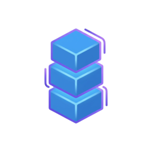

<p align="center">
  
</p>

# PAI Packs

> Self-contained upgrade packages for AI agent systems - like learning kung-fu in The Matrix

**PAI Packs** are modular upgrade packages that add specific capabilities to your AI agent system. Each pack is a complete, self-contained bundle with everything needed to go from a fresh installation to a fully working feature.

---

## What is a Pack?

A pack is a single markdown file containing:

- **The Problem** - What challenge this pack solves
- **The Solution** - How it solves it (with architecture diagrams)
- **Complete Code** - All hooks, tools, libraries, and configuration
- **Installation Instructions** - Step-by-step for both AI and manual installation
- **Verification Steps** - How to confirm it's working
- **Examples** - Real usage scenarios

**Key principle:** Give your AI the pack file, and it can install the entire capability into your system autonomously.

---

## Available Packs

| Pack | Version | Category | Description |
|------|---------|----------|-------------|
| [**kai-hook-system**](kai-hook-system.md) | 1.0.0 | Foundation | Event-driven automation framework - the foundation for all hook-based capabilities including security validation, session management, and context injection |
| [**kai-history-system**](kai-history-system.md) | 1.0.0 | Infrastructure | Granular context-tracking that captures all work, decisions, and learnings automatically with zero manual effort |
| [**kai-skill-system**](kai-skill-system.md) | 1.0.0 | Routing | Complete capability routing through standardized SKILL.md format with dynamic loading and intent-based triggers |
| [**kai-voice-system**](kai-voice-system.md) | 1.1.0 | Notifications | Voice notifications with ElevenLabs TTS, prosody enhancement for natural speech, and personality-driven delivery |
| [**kai-identity**](kai-identity.md) | 1.0.0 | Personality | Personal AI identity with mandatory response format, personality calibration, constitution, and the 14 founding principles |

---

## Installation Order

Packs have dependencies. Install in this order:

```
1. kai-hook-system     ← Foundation (no dependencies)
2. kai-history-system  ← Depends on hooks
3. kai-skill-system    ← Depends on hooks, history
4. kai-voice-system    ← Depends on hooks, skills
5. kai-identity        ← Depends on all above
```

**Or install the complete [Kai Bundle](../Bundles/Kai/)** which handles ordering automatically.

---

## How to Install a Pack

### Option 1: AI-Assisted (Recommended)

Give the pack file to your AI agent:

```
Install this pack into my system. Use PAI_DIR="~/.config/pai" and DA="MyAI".
```

Your AI will:
1. Check dependencies
2. Create directories
3. Save all code files
4. Configure hooks
5. Verify installation

### Option 2: Manual

Open any pack file and follow the "Installation" section step by step.

---

## Pack Categories

| Category | Purpose | Examples |
|----------|---------|----------|
| **Foundation** | Core infrastructure that other packs depend on | Hook System |
| **Infrastructure** | Systems that run automatically in the background | History System |
| **Routing** | Intent detection and capability dispatch | Skill System |
| **Notifications** | User feedback and accessibility | Voice System |
| **Personality** | Identity, response format, principles | Identity |

---

## Creating Your Own Pack

See [PAIPackTemplate.md](../PAIPackTemplate.md) for the complete pack specification.

**Quick checklist:**
- [ ] Single markdown file with YAML frontmatter
- [ ] 256x256 transparent icon in `icons/`
- [ ] Complete, working code (no snippets or placeholders)
- [ ] End-to-end implementation (no "beyond scope" gaps)
- [ ] Both AI-assisted and manual installation instructions
- [ ] Verification commands to confirm success

---

## Pack Quality Standards

Every pack in this directory must be:

1. **Complete** - Everything needed to install, no missing components
2. **Self-contained** - Works without external documentation
3. **Tested** - Verified working in production (extracted from Kai)
4. **Sanitized** - No personal data, credentials, or hardcoded paths
5. **Documented** - Clear problem statement, solution, and examples

---

## Related

- [**Bundles/**](../Bundles/) - Curated collections of packs
- [**PAIPackTemplate.md**](../PAIPackTemplate.md) - Full pack specification
- [**README.md**](../README.md) - PAI project overview

---

*Each pack is extracted from Daniel Miessler's production Kai system - battle-tested capabilities packaged for anyone to use.*
