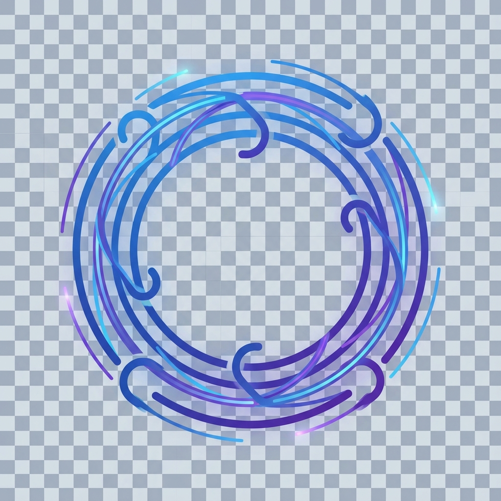

<p align="center">
  
</p>

# Kai Hook System (kai-hook-system)

> Event-driven automation framework for Claude Code - the foundation for all hook-based capabilities

## Installation Prompt
You are receiving a PAI Pack - a modular upgrade for AI agent systems.

**What is PAI?** See: [PAI Project Overview](../README.md#what-is-pai)

**What is a Pack?** See: [Pack System](../README.md#pack-system)

This Pack adds event-driven automation to your AI infrastructure. The Kai Hook System is the foundation that enables all other hook-based Packs to work:

- **Security Validation**: Block dangerous commands before execution
- **Session Management**: Initialize sessions with context and state
- **Context Injection**: Load skill definitions at session start
- **Terminal Integration**: Update tab titles with task context
- **Event Pipeline**: PreToolUse, PostToolUse, Stop, SessionStart, and more

**Core principle:** Hooks intercept events and add intelligence without interrupting work.

Every tool call, every session start, every completion - hooks see it all and can act on it. This is how you make AI infrastructure truly automated.

Please follow the installation instructions below to integrate this Pack into your infrastructure.

---

## The Concept and/or Problem

Claude Code fires events throughout its operation, but by default nothing listens to them:

- **PreToolUse**: Before any tool runs - opportunity to validate, block, or modify
- **PostToolUse**: After any tool runs - opportunity to capture, log, or react
- **Stop**: When the agent finishes responding - opportunity to capture work
- **SessionStart**: When a new session begins - opportunity to initialize
- **SessionEnd**: When a session closes - opportunity to summarize
- **UserPromptSubmit**: When the user sends a message - opportunity to process

Without a hook system:
- Dangerous commands execute without validation
- Sessions start cold without context
- No automation layer between events and actions
- Each capability must be built from scratch

**The Problem:**

Claude Code's hook system is powerful but undocumented in practice. You can configure hooks in settings.json, but:
- What events are available?
- What data does each event provide?
- How do you write hooks that never block or crash?
- How do you chain multiple hooks together?

**The Opportunity:**

Hooks are the foundation for building intelligent AI infrastructure. Once you understand the event model, you can:
- Add security validation to every command
- Inject context at the right moments
- Capture every piece of work automatically
- Integrate with external systems (dashboards, notifications, analytics)

## The Solution

The Kai Hook System provides a complete framework for event-driven automation:

**Core Architecture:**

```
$PAI_DIR/
├── hooks/                           # Hook implementations
│   ├── security-validator.ts        # PreToolUse: Block dangerous commands
│   ├── initialize-session.ts        # SessionStart: Session setup
│   ├── load-core-context.ts         # SessionStart: Context injection
│   ├── update-tab-titles.ts         # UserPromptSubmit: Tab automation
│   └── lib/                         # Shared libraries
│       └── observability.ts         # Dashboard integration
└── settings.json                    # Hook configuration
```

**Hook Event Types:**

| Event | When It Fires | Use Cases |
|-------|---------------|-----------|
| `PreToolUse` | Before a tool executes | Security validation, command modification, blocking |
| `PostToolUse` | After a tool executes | Logging, capturing output, triggering actions |
| `Stop` | Main agent finishes | Capture work summaries, voice notifications |
| `SubagentStop` | Subagent finishes | Capture agent outputs, route to categories |
| `SessionStart` | New session begins | Load context, initialize state |
| `SessionEnd` | Session closes | Summarize work, cleanup |
| `UserPromptSubmit` | User sends message | Process input, update UI |
| `PreCompact` | Before context compaction | Save important context |

**Design Principles:**

1. **Never Block**: Hooks must always exit 0 - never crash Claude Code
2. **Fail Silently**: Errors are logged but don't interrupt work
3. **Fast Execution**: Hooks should complete in milliseconds
4. **Stdin/Stdout**: Events come via stdin JSON, output via stdout
5. **Composable**: Multiple hooks can chain on the same event

**The Key Insight:**

Hooks are middleware for your AI. They sit between Claude Code's event system and your custom logic. By instrumenting the event stream, you gain complete visibility and control over your AI's operations.

---

## Architecture: The Special Sauce

The hook system's power comes from its **event-driven middleware pattern** - a layered architecture that intercepts, processes, and extends every AI operation without modifying Claude Code itself.

```
┌─────────────────────────────────────────────────────────────────────────┐
│                        HOOK SYSTEM ARCHITECTURE                          │
├─────────────────────────────────────────────────────────────────────────┤
│                                                                         │
│  ┌──────────────┐                                                       │
│  │  Claude Code │ ──► Events fire at every operation                    │
│  └──────┬───────┘                                                       │
│         │                                                               │
│         ▼                                                               │
│  ┌──────────────────────────────────────────────────────────────────┐  │
│  │                    LAYER 1: Event Stream                          │  │
│  │  SessionStart ─► PreToolUse ─► PostToolUse ─► Stop ─► SessionEnd  │  │
│  └──────────────────────────────────────────────────────────────────┘  │
│         │                                                               │
│         ▼                                                               │
│  ┌──────────────────────────────────────────────────────────────────┐  │
│  │                    LAYER 2: Hook Registry                         │  │
│  │  settings.json defines which hooks fire on which events           │  │
│  │  Matchers filter by tool name (Bash, Edit, *) or context          │  │
│  └──────────────────────────────────────────────────────────────────┘  │
│         │                                                               │
│         ▼                                                               │
│  ┌──────────────────────────────────────────────────────────────────┐  │
│  │                    LAYER 3: Hook Implementations                  │  │
│  │  TypeScript files that process events and take actions            │  │
│  │  security-validator.ts │ initialize-session.ts │ update-tabs.ts   │  │
│  └──────────────────────────────────────────────────────────────────┘  │
│         │                                                               │
│         ▼                                                               │
│  ┌──────────────────────────────────────────────────────────────────┐  │
│  │                    LAYER 4: Shared Libraries                      │  │
│  │  Common utilities: observability.ts, prosody-enhancer.ts          │  │
│  │  Fail-safe patterns, logging, integration helpers                 │  │
│  └──────────────────────────────────────────────────────────────────┘  │
│         │                                                               │
│         ▼                                                               │
│  ┌──────────────────────────────────────────────────────────────────┐  │
│  │                    LAYER 5: External Integrations                 │  │
│  │  Observability dashboards, voice servers, notification systems    │  │
│  └──────────────────────────────────────────────────────────────────┘  │
│                                                                         │
└─────────────────────────────────────────────────────────────────────────┘
```

### How Data Flows Through the System

**Example: User runs `rm -rf important/`**

```
1. Claude Code invokes Bash tool
         │
         ▼
2. PreToolUse event fires with payload:
   { tool_name: "Bash", tool_input: { command: "rm -rf important/" } }
         │
         ▼
3. settings.json routes to security-validator.ts (matcher: "Bash")
         │
         ▼
4. Hook receives JSON via stdin, pattern-matches against attack tiers
         │
         ▼
5. MATCH: Catastrophic deletion pattern detected
         │
         ▼
6. Hook exits with code 2 (BLOCK) + outputs warning message
         │
         ▼
7. Claude Code sees exit 2, BLOCKS the command
         │
         ▼
8. User sees: "🚨 BLOCKED: Catastrophic deletion detected"
```

### Why This Architecture Matters

**1. Separation of Concerns**
- Event stream (Claude Code) is separate from hook logic (your code)
- Registration (settings.json) is separate from implementation (.ts files)
- Each hook does one thing well (UNIX philosophy)

**2. Fail-Safe by Design**
- Hooks NEVER crash Claude Code (exit 0 on errors)
- External integrations fail silently (observability down? keep working)
- Fast execution (milliseconds, not seconds)

**3. Composable Pipeline**
- Multiple hooks can chain on the same event
- Each hook processes independently
- Order defined in settings.json

**4. Deterministic Behavior**
- Same event + same hook = same outcome
- Pattern matching is explicit, not fuzzy
- Exit codes have precise meanings (0=allow, 2=block)

**5. Zero-Overhead Extensibility**
- Add new hooks without modifying existing ones
- Add new event handlers without touching Claude Code
- Shared libraries reduce duplication

### What Problems This Architecture Prevents

| Problem | How Hooks Solve It |
|---------|-------------------|
| Dangerous commands execute | PreToolUse validates before execution |
| Sessions start cold | SessionStart injects context automatically |
| Work disappears | Stop/SubagentStop capture everything |
| No visibility into operations | PostToolUse logs to observability |
| UI doesn't show context | UserPromptSubmit updates tab titles |

### The Fundamental Insight

**Naive approach:** Build safety/automation INTO the AI prompts
- Fragile (prompts can be ignored)
- Inconsistent (varies by session)
- Invisible (no audit trail)

**Hook approach:** Build safety/automation AROUND the AI as middleware
- Robust (code can't be prompt-injected)
- Consistent (same code runs every time)
- Observable (events logged, actions traced)

The hook system transforms Claude Code from a standalone tool into an **observable, controllable, extensible infrastructure**. Every operation can be validated, logged, modified, or blocked. This is the foundation that enables all other PAI capabilities.

---

## Why This Is Different

This sounds similar to Claude Code's built-in hooks in settings.json, which also intercept events. What makes this approach different?

Claude Code exposes hook events but provides no framework for using them effectively. You get raw events with no patterns for security validation, no libraries for safe execution, no templates for common use cases. The Kai Hook System provides production-ready hook implementations that transform these raw events into intelligent automation. Every hook follows fail-safe patterns that never block agent work, with shared libraries for observability, logging, and integration.

- Production-ready security validation for every Bash command
- Fail-safe patterns ensure hooks never block work
- Shared libraries for observability and logging included
- Complete event documentation with practical code examples

---

## Installation

### Prerequisites

- **Bun runtime**: `curl -fsSL https://bun.sh/install | bash`
- **Claude Code** (or compatible agent system with hook support)
- **Write access** to `$PAI_DIR/` (or your PAI directory)

### Step 1: Create Directory Structure

```bash
# Create required directories
mkdir -p $PAI_DIR/hooks/lib

# Verify structure
ls -la $PAI_DIR/hooks/
```

---

### Step 2: Create Library Files

#### 2.1: Create observability.ts

This library enables integration with observability dashboards.

```typescript
// $PAI_DIR/hooks/lib/observability.ts
// Sends hook events to observability dashboards

export interface ObservabilityEvent {
  source_app: string;
  session_id: string;
  hook_event_type: 'PreToolUse' | 'PostToolUse' | 'UserPromptSubmit' | 'Notification' | 'Stop' | 'SubagentStop' | 'SessionStart' | 'SessionEnd' | 'PreCompact';
  timestamp: string;
  transcript_path?: string;
  summary?: string;
  tool_name?: string;
  tool_input?: any;
  tool_output?: any;
  agent_type?: string;
  model?: string;
  [key: string]: any;
}

/**
 * Send event to observability dashboard
 * Fails silently if dashboard is not running - doesn't block hook execution
 */
export async function sendEventToObservability(event: ObservabilityEvent): Promise<void> {
  const dashboardUrl = process.env.PAI_OBSERVABILITY_URL || 'http://localhost:4000/events';

  try {
    const response = await fetch(dashboardUrl, {
      method: 'POST',
      headers: {
        'Content-Type': 'application/json',
        'User-Agent': 'PAI-Hook/1.0'
      },
      body: JSON.stringify(event),
    });

    if (!response.ok) {
      // Log error but don't throw - dashboard may be offline
      console.error(`Observability server returned status: ${response.status}`);
    }
  } catch (error) {
    // Fail silently - dashboard may not be running
    // This is intentional - hooks should never fail due to observability issues
  }
}

/**
 * Helper to get current timestamp in ISO format
 */
export function getCurrentTimestamp(): string {
  return new Date().toISOString();
}

/**
 * Helper to get source app name from environment
 */
export function getSourceApp(): string {
  return process.env.PAI_SOURCE_APP || process.env.DA || 'PAI';
}
```

---

### Step 3: Create Hook Files

#### 3.1: Create security-validator.ts (PreToolUse Security)

This hook validates commands before execution and blocks dangerous operations.

```typescript
#!/usr/bin/env bun
// $PAI_DIR/hooks/security-validator.ts
// PreToolUse hook: Validates commands and blocks dangerous operations

import { sendEventToObservability, getCurrentTimestamp, getSourceApp } from './lib/observability';

interface PreToolUsePayload {
  session_id: string;
  tool_name: string;
  tool_input: Record<string, any>;
}

// Attack pattern categories
const ATTACK_PATTERNS = {
  // Tier 1: Catastrophic - Always block
  catastrophic: {
    patterns: [
      /rm\s+(-rf?|--recursive)\s+[\/~]/i,           // rm -rf /
      /rm\s+(-rf?|--recursive)\s+\*/i,              // rm -rf *
      />\s*\/dev\/sd[a-z]/i,                        // Overwrite disk
      /mkfs\./i,                                     // Format filesystem
      /dd\s+if=.*of=\/dev/i,                        // dd to device
    ],
    action: 'block',
    message: '🚨 BLOCKED: Catastrophic deletion/destruction detected'
  },

  // Tier 2: Reverse shells - Always block
  reverseShell: {
    patterns: [
      /bash\s+-i\s+>&\s*\/dev\/tcp/i,              // Bash reverse shell
      /nc\s+(-e|--exec)\s+\/bin\/(ba)?sh/i,        // Netcat shell
      /python.*socket.*connect/i,                   // Python socket
      /perl.*socket.*connect/i,                     // Perl socket
      /ruby.*TCPSocket/i,                          // Ruby socket
      /php.*fsockopen/i,                           // PHP socket
      /socat.*exec/i,                              // Socat exec
      /\|\s*\/bin\/(ba)?sh/i,                      // Pipe to shell
    ],
    action: 'block',
    message: '🚨 BLOCKED: Reverse shell pattern detected'
  },

  // Tier 3: Credential theft - Always block
  credentialTheft: {
    patterns: [
      /curl.*\|\s*(ba)?sh/i,                       // curl pipe to shell
      /wget.*\|\s*(ba)?sh/i,                       // wget pipe to shell
      /curl.*(-o|--output).*&&.*chmod.*\+x/i,      // Download and execute
      /base64\s+-d.*\|\s*(ba)?sh/i,                // Base64 decode to shell
    ],
    action: 'block',
    message: '🚨 BLOCKED: Remote code execution pattern detected'
  },

  // Tier 4: Prompt injection indicators - Block and log
  promptInjection: {
    patterns: [
      /ignore\s+(all\s+)?previous\s+instructions/i,
      /disregard\s+(all\s+)?prior\s+instructions/i,
      /you\s+are\s+now\s+(in\s+)?[a-z]+\s+mode/i,
      /new\s+instruction[s]?:/i,
      /system\s+prompt:/i,
      /\[INST\]/i,                                  // LLM injection
      /<\|im_start\|>/i,                           // ChatML injection
    ],
    action: 'block',
    message: '🚨 BLOCKED: Prompt injection pattern detected - logging incident'
  },

  // Tier 5: Environment manipulation - Warn
  envManipulation: {
    patterns: [
      /export\s+(ANTHROPIC|OPENAI|AWS|AZURE)_/i,   // API key export
      /echo\s+\$\{?(ANTHROPIC|OPENAI)_/i,          // Echo API keys
      /env\s*\|.*KEY/i,                            // Dump env with keys
      /printenv.*KEY/i,                            // Print env keys
    ],
    action: 'warn',
    message: '⚠️ WARNING: Environment/credential access detected'
  },

  // Tier 6: Git dangerous operations - Require confirmation
  gitDangerous: {
    patterns: [
      /git\s+push.*(-f|--force)/i,                 // Force push
      /git\s+reset\s+--hard/i,                     // Hard reset
      /git\s+clean\s+-fd/i,                        // Clean untracked
      /git\s+checkout\s+--\s+\./i,                 // Discard all changes
    ],
    action: 'confirm',
    message: '⚠️ CONFIRM: Potentially destructive git operation'
  },

  // Tier 7: System modification - Log
  systemMod: {
    patterns: [
      /chmod\s+777/i,                              // World writable
      /chown\s+root/i,                             // Change to root
      /sudo\s+/i,                                  // Sudo usage
      /systemctl\s+(stop|disable)/i,               // Stop services
    ],
    action: 'log',
    message: '📝 LOGGED: System modification command'
  },

  // Tier 8: Network operations - Log
  network: {
    patterns: [
      /ssh\s+/i,                                   // SSH connections
      /scp\s+/i,                                   // SCP transfers
      /rsync.*:/i,                                 // Rsync remote
      /curl\s+(-X\s+POST|--data)/i,               // POST requests
    ],
    action: 'log',
    message: '📝 LOGGED: Network operation'
  },

  // Tier 9: Data exfiltration patterns - Block
  exfiltration: {
    patterns: [
      /curl.*(@|--upload-file)/i,                  // Upload file
      /tar.*\|.*curl/i,                            // Tar and send
      /zip.*\|.*nc/i,                              // Zip and netcat
    ],
    action: 'block',
    message: '🚨 BLOCKED: Data exfiltration pattern detected'
  },

  // Tier 10: PAI-specific protection - Block
  paiProtection: {
    patterns: [
      /rm.*\.config\/pai/i,                        // Delete PAI config
      /rm.*\.claude/i,                             // Delete Claude config
      /git\s+push.*PAI.*public/i,                  // Push PAI to public
    ],
    action: 'block',
    message: '🚨 BLOCKED: PAI infrastructure protection triggered'
  }
};

function validateCommand(command: string): { allowed: boolean; message?: string; action?: string } {
  // Fast path: Most commands are safe
  if (!command || command.length < 3) {
    return { allowed: true };
  }

  // Check each tier
  for (const [tierName, tier] of Object.entries(ATTACK_PATTERNS)) {
    for (const pattern of tier.patterns) {
      if (pattern.test(command)) {
        const result = {
          allowed: tier.action !== 'block',
          message: tier.message,
          action: tier.action
        };

        // Log security event
        console.error(`[Security] ${tierName}: ${tier.message}`);
        console.error(`[Security] Command: ${command.substring(0, 100)}...`);

        return result;
      }
    }
  }

  return { allowed: true };
}

async function main() {
  try {
    const stdinData = await Bun.stdin.text();
    if (!stdinData.trim()) {
      process.exit(0);
    }

    const payload: PreToolUsePayload = JSON.parse(stdinData);

    // Only validate Bash commands
    if (payload.tool_name !== 'Bash') {
      process.exit(0);
    }

    const command = payload.tool_input?.command;
    if (!command) {
      process.exit(0);
    }

    const validation = validateCommand(command);

    // Send to observability if configured
    if (validation.action) {
      await sendEventToObservability({
        source_app: getSourceApp(),
        session_id: payload.session_id,
        hook_event_type: 'PreToolUse',
        timestamp: getCurrentTimestamp(),
        tool_name: 'Bash',
        tool_input: { command: command.substring(0, 200) },
        security_action: validation.action,
        security_message: validation.message
      });
    }

    if (!validation.allowed) {
      // Output the block message - Claude Code will see this
      console.log(validation.message);
      console.log(`Command blocked: ${command.substring(0, 100)}...`);

      // Exit with code 2 to signal block (Claude Code specific)
      process.exit(2);
    }

    // Log warnings but allow execution
    if (validation.action === 'warn' || validation.action === 'confirm') {
      console.log(validation.message);
    }

  } catch (error) {
    // Never crash - log error and allow command
    console.error('Security validator error:', error);
  }

  // Exit 0 = allow the command
  process.exit(0);
}

main();
```

#### 3.2: Create initialize-session.ts (SessionStart)

This hook runs at session start to initialize state and environment.

```typescript
#!/usr/bin/env bun
// $PAI_DIR/hooks/initialize-session.ts
// SessionStart hook: Initialize session state and environment

import { existsSync, writeFileSync, mkdirSync } from 'fs';
import { join } from 'path';
import { homedir } from 'os';
import { sendEventToObservability, getCurrentTimestamp, getSourceApp } from './lib/observability';

interface SessionStartPayload {
  session_id: string;
  cwd?: string;
  [key: string]: any;
}

function getLocalTimestamp(): string {
  const date = new Date();
  const tz = process.env.TIME_ZONE || Intl.DateTimeFormat().resolvedOptions().timeZone;

  try {
    const localDate = new Date(date.toLocaleString('en-US', { timeZone: tz }));
    const year = localDate.getFullYear();
    const month = String(localDate.getMonth() + 1).padStart(2, '0');
    const day = String(localDate.getDate()).padStart(2, '0');
    const hours = String(localDate.getHours()).padStart(2, '0');
    const minutes = String(localDate.getMinutes()).padStart(2, '0');
    const seconds = String(localDate.getSeconds()).padStart(2, '0');

    return `${year}-${month}-${day} ${hours}:${minutes}:${seconds}`;
  } catch {
    return new Date().toISOString();
  }
}

function setTabTitle(title: string): void {
  // OSC escape sequence for terminal tab title
  const tabEscape = `\x1b]1;${title}\x07`;
  const windowEscape = `\x1b]2;${title}\x07`;

  process.stderr.write(tabEscape);
  process.stderr.write(windowEscape);
}

function getProjectName(cwd: string | undefined): string {
  if (!cwd) return 'Session';

  // Extract project name from path
  const parts = cwd.split('/').filter(p => p);

  // Look for common project indicators
  const projectIndicators = ['Projects', 'projects', 'src', 'repos', 'code'];
  for (let i = parts.length - 1; i >= 0; i--) {
    if (projectIndicators.includes(parts[i]) && parts[i + 1]) {
      return parts[i + 1];
    }
  }

  // Default to last directory component
  return parts[parts.length - 1] || 'Session';
}

async function checkForUpdates(): Promise<void> {
  // Optional: Check for Claude Code updates in background
  // This is non-blocking and fails silently
  try {
    const proc = Bun.spawn(['claude', '--version'], {
      stdout: 'pipe',
      stderr: 'pipe'
    });

    const output = await new Response(proc.stdout).text();
    const version = output.trim().match(/[\d.]+/)?.[0];

    if (version) {
      // Could compare against known latest version
      // For now, just log it
      console.error(`[PAI] Claude Code version: ${version}`);
    }
  } catch {
    // Silently ignore - version check is optional
  }
}

async function main() {
  try {
    const stdinData = await Bun.stdin.text();
    if (!stdinData.trim()) {
      process.exit(0);
    }

    const payload: SessionStartPayload = JSON.parse(stdinData);
    const paiDir = process.env.PAI_DIR || join(homedir(), '.config', 'pai');

    // 1. Set initial tab title
    const projectName = getProjectName(payload.cwd);
    setTabTitle(`🤖 ${projectName}`);

    // 2. Ensure required directories exist
    const requiredDirs = [
      join(paiDir, 'hooks', 'lib'),
      join(paiDir, 'history', 'sessions'),
      join(paiDir, 'history', 'learnings'),
      join(paiDir, 'history', 'research'),
    ];

    for (const dir of requiredDirs) {
      if (!existsSync(dir)) {
        mkdirSync(dir, { recursive: true });
      }
    }

    // 3. Create session marker file (optional - for tracking)
    const sessionFile = join(paiDir, '.current-session');
    writeFileSync(sessionFile, JSON.stringify({
      session_id: payload.session_id,
      started: getLocalTimestamp(),
      cwd: payload.cwd,
      project: projectName
    }, null, 2));

    // 4. Send to observability dashboard
    await sendEventToObservability({
      source_app: getSourceApp(),
      session_id: payload.session_id,
      hook_event_type: 'SessionStart',
      timestamp: getCurrentTimestamp(),
      cwd: payload.cwd,
      project: projectName
    });

    // 5. Background version check (non-blocking)
    checkForUpdates().catch(() => {});

    // Output session info
    console.error(`[PAI] Session initialized: ${projectName}`);
    console.error(`[PAI] Time: ${getLocalTimestamp()}`);

  } catch (error) {
    // Never crash - just log
    console.error('Session initialization error:', error);
  }

  process.exit(0);
}

main();
```

#### 3.3: Create load-core-context.ts (SessionStart Context Injection)

This hook loads skill definitions into the AI's context at session start.

```typescript
#!/usr/bin/env bun
// $PAI_DIR/hooks/load-core-context.ts
// SessionStart hook: Inject skill/context files into Claude's context

import { existsSync, readFileSync } from 'fs';
import { join } from 'path';
import { homedir } from 'os';

interface SessionStartPayload {
  session_id: string;
  [key: string]: any;
}

function isSubagentSession(): boolean {
  // Check for subagent indicators
  // Subagents shouldn't load full context (they get it from parent)
  return process.env.CLAUDE_CODE_AGENT !== undefined ||
         process.env.SUBAGENT === 'true';
}

function getLocalTimestamp(): string {
  const date = new Date();
  const tz = process.env.TIME_ZONE || Intl.DateTimeFormat().resolvedOptions().timeZone;

  try {
    const localDate = new Date(date.toLocaleString('en-US', { timeZone: tz }));
    const year = localDate.getFullYear();
    const month = String(localDate.getMonth() + 1).padStart(2, '0');
    const day = String(localDate.getDate()).padStart(2, '0');
    const hours = String(localDate.getHours()).padStart(2, '0');
    const minutes = String(localDate.getMinutes()).padStart(2, '0');
    const seconds = String(localDate.getSeconds()).padStart(2, '0');

    return `${year}-${month}-${day} ${hours}:${minutes}:${seconds} PST`;
  } catch {
    return new Date().toISOString();
  }
}

async function main() {
  try {
    // Skip for subagents - they get context from parent
    if (isSubagentSession()) {
      process.exit(0);
    }

    const stdinData = await Bun.stdin.text();
    if (!stdinData.trim()) {
      process.exit(0);
    }

    const payload: SessionStartPayload = JSON.parse(stdinData);
    const paiDir = process.env.PAI_DIR || join(homedir(), '.config', 'pai');

    // Look for CORE skill to load
    // The CORE skill contains identity, response format, and operating principles
    const coreSkillPath = join(paiDir, 'skills', 'CORE', 'SKILL.md');

    if (!existsSync(coreSkillPath)) {
      // No CORE skill installed - that's fine
      console.error('[PAI] No CORE skill found - skipping context injection');
      process.exit(0);
    }

    // Read the skill content
    const skillContent = readFileSync(coreSkillPath, 'utf-8');

    // Output as system-reminder for Claude to process
    // This format is recognized by Claude Code
    const output = `<system-reminder>
PAI CORE CONTEXT (Auto-loaded at Session Start)

📅 CURRENT DATE/TIME: ${getLocalTimestamp()}

The following context has been loaded from ${coreSkillPath}:

${skillContent}

This context is now active for this session. Follow all instructions, preferences, and guidelines contained above.
</system-reminder>

✅ PAI Context successfully loaded...`;

    // Output goes to stdout - Claude Code will see it
    console.log(output);

  } catch (error) {
    // Never crash - just skip
    console.error('Context loading error:', error);
  }

  process.exit(0);
}

main();
```

#### 3.4: Create update-tab-titles.ts (UserPromptSubmit)

This hook updates terminal tab titles with task context.

```typescript
#!/usr/bin/env bun
// $PAI_DIR/hooks/update-tab-titles.ts
// UserPromptSubmit hook: Update terminal tab title with task context

interface UserPromptPayload {
  session_id: string;
  prompt?: string;
  message?: string;
  [key: string]: any;
}

function setTabTitle(title: string): void {
  // OSC escape sequences for terminal tab and window titles
  const tabEscape = `\x1b]1;${title}\x07`;
  const windowEscape = `\x1b]2;${title}\x07`;

  process.stderr.write(tabEscape);
  process.stderr.write(windowEscape);
}

function extractTaskKeywords(prompt: string): string {
  // Remove common filler words
  const stopWords = new Set([
    'the', 'a', 'an', 'and', 'or', 'but', 'in', 'on', 'at', 'to', 'for',
    'of', 'with', 'by', 'from', 'is', 'are', 'was', 'were', 'be', 'been',
    'being', 'have', 'has', 'had', 'do', 'does', 'did', 'will', 'would',
    'could', 'should', 'may', 'might', 'must', 'can', 'this', 'that',
    'these', 'those', 'i', 'you', 'he', 'she', 'it', 'we', 'they', 'me',
    'my', 'your', 'please', 'help', 'want', 'need', 'like', 'just'
  ]);

  // Clean and tokenize
  const words = prompt
    .toLowerCase()
    .replace(/[^\w\s-]/g, ' ')
    .split(/\s+/)
    .filter(word => word.length > 2 && !stopWords.has(word));

  // Take first 3-4 significant words
  const keywords = words.slice(0, 4);

  if (keywords.length === 0) {
    return 'Working';
  }

  // Capitalize first word
  keywords[0] = keywords[0].charAt(0).toUpperCase() + keywords[0].slice(1);

  return keywords.join(' ');
}

function launchBackgroundSummarization(prompt: string, sessionId: string): void {
  // Optional: Launch a background process to get a better title via AI
  // This is fire-and-forget - doesn't block the hook

  // Skip if prompt is too short
  if (prompt.length < 20) return;

  // This could call a fast model (e.g., Haiku) to summarize
  // For now, we just use keyword extraction (instant)

  // Example of what background summarization would look like:
  // Bun.spawn(['bun', 'run', 'summarize-task.ts', '--prompt', prompt], {
  //   stdout: 'ignore',
  //   stderr: 'ignore'
  // });
}

async function main() {
  try {
    const stdinData = await Bun.stdin.text();
    if (!stdinData.trim()) {
      process.exit(0);
    }

    const payload: UserPromptPayload = JSON.parse(stdinData);
    const prompt = payload.prompt || payload.message || '';

    if (!prompt || prompt.length < 3) {
      process.exit(0);
    }

    // Generate quick title from keywords (instant)
    const keywords = extractTaskKeywords(prompt);
    setTabTitle(`🤖 ${keywords}`);

    // Optionally launch background summarization for better title
    launchBackgroundSummarization(prompt, payload.session_id);

  } catch (error) {
    // Never crash
    console.error('Tab title update error:', error);
  }

  process.exit(0);
}

main();
```

---

### Step 4: Register Hooks in settings.json

Claude Code looks for settings in `~/.claude/settings.json`. Add or merge the following hook configuration:

**File location:** `~/.claude/settings.json`

```json
{
  "hooks": {
    "SessionStart": [
      {
        "matcher": "*",
        "hooks": [
          {
            "type": "command",
            "command": "bun run $PAI_DIR/hooks/initialize-session.ts"
          },
          {
            "type": "command",
            "command": "bun run $PAI_DIR/hooks/load-core-context.ts"
          }
        ]
      }
    ],
    "PreToolUse": [
      {
        "matcher": "Bash",
        "hooks": [
          {
            "type": "command",
            "command": "bun run $PAI_DIR/hooks/security-validator.ts"
          }
        ]
      }
    ],
    "UserPromptSubmit": [
      {
        "matcher": "*",
        "hooks": [
          {
            "type": "command",
            "command": "bun run $PAI_DIR/hooks/update-tab-titles.ts"
          }
        ]
      }
    ]
  }
}
```

**Important:** If you already have a settings.json, merge the hooks section with your existing configuration.

---

### Step 5: Set Environment Variables (Optional)

Add these to your shell profile (`~/.zshrc`, `~/.bashrc`, etc.):

```bash
# PAI configuration
export PAI_DIR="$HOME/.config/pai"
export TIME_ZONE="America/Los_Angeles"  # Your timezone
export DA="PAI"  # Your AI assistant name

# Optional: Observability dashboard URL
export PAI_OBSERVABILITY_URL="http://localhost:4000/events"

# Reload shell
source ~/.zshrc
```

---

### Step 6: Verify Installation

```bash
# 1. Check all hooks exist
ls -la $PAI_DIR/hooks/*.ts
# Should show: security-validator.ts, initialize-session.ts,
#              load-core-context.ts, update-tab-titles.ts

# 2. Check lib files exist
ls -la $PAI_DIR/hooks/lib/*.ts
# Should show: observability.ts

# 3. Test security validator with a safe command
echo '{"session_id":"test","tool_name":"Bash","tool_input":{"command":"ls -la"}}' | \
  bun run $PAI_DIR/hooks/security-validator.ts
# Should exit 0 (allowed)

# 4. Test security validator with a dangerous command
echo '{"session_id":"test","tool_name":"Bash","tool_input":{"command":"rm -rf /"}}' | \
  bun run $PAI_DIR/hooks/security-validator.ts
# Should exit 2 (blocked) and print warning

# 5. Test session initialization
echo '{"session_id":"test","cwd":"/Users/you/Projects/MyProject"}' | \
  bun run $PAI_DIR/hooks/initialize-session.ts
# Should set tab title and create session marker

# 6. Restart Claude Code to activate hooks
```

**Success indicators:**
- Security validator blocks dangerous commands (exit code 2)
- Security validator allows safe commands (exit code 0)
- Tab title updates when you send prompts
- Session marker created at $PAI_DIR/.current-session

---

## Hook Event Reference

### Event Payloads

Each hook receives a JSON payload via stdin:

**PreToolUse:**
```json
{
  "session_id": "uuid",
  "tool_name": "Bash",
  "tool_input": {
    "command": "ls -la"
  }
}
```

**PostToolUse:**
```json
{
  "session_id": "uuid",
  "tool_name": "Bash",
  "tool_input": { "command": "ls -la" },
  "tool_output": "file1.txt\nfile2.txt"
}
```

**Stop:**
```json
{
  "session_id": "uuid",
  "stop_hook_active": true,
  "transcript_path": "/path/to/transcript.jsonl",
  "response": "The full assistant response text"
}
```

**SubagentStop:**
```json
{
  "session_id": "uuid",
  "transcript_path": "/path/to/agent-transcript.jsonl"
}
```

**SessionStart:**
```json
{
  "session_id": "uuid",
  "cwd": "/current/working/directory"
}
```

**SessionEnd:**
```json
{
  "conversation_id": "uuid",
  "timestamp": "2025-01-15T10:30:00Z"
}
```

**UserPromptSubmit:**
```json
{
  "session_id": "uuid",
  "prompt": "User's message text"
}
```

### Exit Codes

| Exit Code | Meaning | Use Case |
|-----------|---------|----------|
| 0 | Success / Allow | Hook completed, tool can proceed |
| 1 | Error (non-blocking) | Hook failed but don't block |
| 2 | Block | PreToolUse only: prevent tool execution |

### Matcher Patterns

Hooks can be filtered by tool name:

```json
{
  "matcher": "Bash",           // Only Bash tool
  "matcher": "Edit",           // Only Edit tool
  "matcher": "Read|Write",     // Read OR Write
  "matcher": "*"               // All tools
}
```

---

## Example Usage

### Example 1: Adding a Custom Security Rule

```typescript
// Add to ATTACK_PATTERNS in security-validator.ts

customRule: {
  patterns: [
    /my-dangerous-pattern/i,
  ],
  action: 'block',
  message: '🚨 BLOCKED: Custom security rule triggered'
}
```

### Example 2: Injecting Project-Specific Context

```typescript
// In load-core-context.ts, add project-specific context loading

const projectContextPath = join(payload.cwd, '.pai', 'context.md');
if (existsSync(projectContextPath)) {
  const projectContext = readFileSync(projectContextPath, 'utf-8');
  console.log(`<system-reminder>${projectContext}</system-reminder>`);
}
```

### Example 3: Custom Tab Title Format

```typescript
// Modify update-tab-titles.ts for custom format

function setTabTitle(title: string): void {
  const prefix = process.env.PAI_TAB_PREFIX || '🤖';
  const fullTitle = `${prefix} ${title}`;
  // ... rest of function
}
```

---

## Configuration

**Environment variables:**

| Variable | Default | Purpose |
|----------|---------|---------|
| `PAI_DIR` | `~/.config/pai` | Root PAI directory |
| `TIME_ZONE` | System default | Timestamp timezone |
| `DA` | `PAI` | AI assistant name |
| `PAI_OBSERVABILITY_URL` | `http://localhost:4000/events` | Dashboard endpoint |
| `PAI_TAB_PREFIX` | `🤖` | Tab title prefix |

**Settings file locations:**
- Claude Code: `~/.claude/settings.json`
- OpenCode: Check your platform's hook configuration

---

## Credits

- **Original concept**: Daniel Miessler - developed as part of Kai personal AI infrastructure
- **Contributors**: The PAI community
- **Hook system**: Anthropic Claude Code team

## Related Work

*None specified - maintainer to provide if applicable.*

## Works Well With

*None specified - maintainer to provide if applicable.*

## Recommended

*None specified - maintainer to provide if applicable.*

## Relationships

### Parent Of
*None specified.*

### Child Of
*None specified.*

### Sibling Of
*None specified.*

### Part Of Collection
*None specified.*

---

## Changelog

### 1.0.0 - 2025-12-29
- Initial release
- Four core hooks: security-validator, initialize-session, load-core-context, update-tab-titles
- One lib file: observability
- Complete hook event reference documentation
- Security validation with 10 tiers of attack pattern detection
- Session initialization with tab title automation
- Context injection for skill loading
