<div align="center">

<picture>
  <source media="(prefers-color-scheme: dark)" srcset="./pai-logo.png">
  <source media="(prefers-color-scheme: light)" srcset="./pai-logo.png">
  
</picture>

<br/>
<br/>

# Personal AI Infrastructure

### Open-source scaffolding for building your own AI-powered operating system

<br/>

[](https://github.com/danielmiessler/Personal_AI_Infrastructure/releases)
[](LICENSE)
[](https://claude.ai/code)

<br/>

[**Quick Start**](#-quick-start) · [**Documentation**](#-documentation) · [**Examples**](#-examples) · [**Updates**](#-updates) · [**Community**](#-community)

<br/>

---

<br/>

*"This project exists so that the best AI in the world is not only used by a few, but can be used by everyone."*

</div>

<br/>

Right now the most powerful AI setups are being built inside companies with massive engineering teams. That's backwards. These tools should be available to individuals—to you—so you can build your own AI system that actually knows how you work.

That's what PAI is. It's the scaffolding for building a personal AI that gets better over time because it's *yours*. Not some generic chatbot. **Your system, your skills, your workflows.**

<br/>

## What is PAI?

PAI (Personal AI Infrastructure) is an open-source template for building your own AI-powered operating system using Claude Code.

```mermaid
graph LR
    subgraph PAI["🧠 PAI"]
        direction TB
        CORE["CORE<br/>Identity & Config"]
        SKILLS["Skills<br/>Capabilities"]
        AGENTS["Agents<br/>Personalities"]
        HOOKS["Hooks<br/>Automation"]
    end

    USER["👤 You"] --> PAI
    PAI --> OUTPUT["✨ Your AI System"]

    CORE --> SKILLS
    SKILLS --> AGENTS
    AGENTS --> HOOKS
```



<table>
<tr>
<td width="33%" valign="top">

### 🎯 Skills
Self-contained AI capabilities with routing, workflows, and documentation

</td>
<td width="33%" valign="top">

### 🤖 Agents
Specialized AI personalities for different tasks (engineer, researcher, designer)

</td>
<td width="33%" valign="top">

### ⚡ Hooks
Event-driven automation that captures work and manages state

</td>
</tr>
</table>

> [!TIP]
> **Start clean, small, and simple.** Build the scaffolding that makes AI reliable.

<br/>

## What's New in v0.9.0

Big updates! PAI is now fully **platform-agnostic** — your AI identity, your system.

| Feature | Description |
|---------|-------------|
| 📊 **Observability Dashboard** | Real-time agent monitoring with live charts |
| 🎭 **Genericized Identity** | Configure your DA name, it flows everywhere |
| ⚙️ **Better Configuration** | Clear docs for all environment variables |

👉 [**See full changelog**](#-updates)

<br/>

## PAI vs Kai

<table>
<tr>
<th width="50%">✅ PAI (this repository)</th>
<th width="50%">🔒 Kai (Daniel's private system)</th>
</tr>
<tr>
<td>

Skills/agents/hooks architecture<br/>
CORE documentation and routing<br/>
History system (UOCS)<br/>
Example skills (research, fabric, etc.)<br/>
Voice server skeleton<br/>
<br/>
⚙️ **Requires:** API key configuration

</td>
<td>

Personal data, contacts, history<br/>
Additional private skills<br/>
Custom agent personalities<br/>
Production integrations<br/>
Automations and workflows

</td>
</tr>
</table>

> [!NOTE]
> **PAI is the scaffolding. You build your own "Kai" on top of it.**

**After setup, PAI should:** Execute hooks without errors · Load CORE context at session start · Route skills correctly · Capture session history · Launch agents successfully

```bash
# Not working? Run the health check:
bun ${PAI_DIR}/hooks/self-test.ts
```

<br/>

## 🚀 Quick Start

### 1. Install Prerequisites

```bash
# Install Bun (PAI's package manager)
curl -fsSL https://bun.sh/install | bash

# Install Claude Code — https://code.claude.com
```

### 2. Clone and Configure

```bash
git clone https://github.com/danielmiessler/Personal_AI_Infrastructure.git
cd Personal_AI_Infrastructure

# Copy environment template and add your API keys
cp .claude/.env.example .claude/.env
```

### 3. Copy to Your System

```bash
# Backup existing config (if any)
[ -d ~/.claude ] && mv ~/.claude ~/.claude.backup.$(date +%Y%m%d_%H%M%S)

# Copy PAI to your home directory
cp -r .claude ~/.claude
```

<details>
<summary><strong>Alternative: Symlink</strong> (keeps PAI updatable via git pull)</summary>

```bash
[ -d ~/.claude ] && mv ~/.claude ~/.claude.backup.$(date +%Y%m%d_%H%M%S)
ln -s $(pwd)/.claude ~/.claude
```

</details>

### 4. Start Claude Code

```bash
claude
```

> [!IMPORTANT]
> The CORE skill loads automatically at session start and provides all PAI functionality.

📚 For detailed setup, see [`docs/QUICKSTART.md`](docs/QUICKSTART.md)

<br/>

## 📚 Documentation

All documentation lives in the CORE skill (`.claude/skills/CORE/`):

<details open>
<summary><strong>📖 Essential Reading</strong></summary>

| Document | Description |
|----------|-------------|
| [**CONSTITUTION.md**](.claude/skills/CORE/CONSTITUTION.md) | System philosophy, architecture, operating principles |
| [**SKILL.md**](.claude/skills/CORE/SKILL.md) | Main PAI skill with identity, preferences, quick reference |
| [**SKILL-STRUCTURE-AND-ROUTING.md**](.claude/skills/CORE/SKILL-STRUCTURE-AND-ROUTING.md) | How to create your own skills |

</details>

<details>
<summary><strong>🔧 System Guides</strong></summary>

| Document | Description |
|----------|-------------|
| [hook-system.md](.claude/skills/CORE/hook-system.md) | Event-driven automation |
| [history-system.md](.claude/skills/CORE/history-system.md) | Automatic work documentation |
| [voice-server/README.md](.claude/voice-server/README.md) | Text-to-speech feedback |

</details>

<details>
<summary><strong>📋 Reference</strong></summary>

| Document | Description |
|----------|-------------|
| [prosody-guide.md](.claude/skills/CORE/prosody-guide.md) | Voice emotion system |
| [prompting.md](.claude/skills/CORE/prompting.md) | Prompt engineering patterns |
| [terminal-tabs.md](.claude/skills/CORE/terminal-tabs.md) | Terminal management |

</details>

<br/>

## 🎨 Examples

Explore example skills in `.claude/skills/`:

| Skill | Description |
|-------|-------------|
| **observability/** | Real-time agent monitoring dashboard with WebSocket streaming |
| **brightdata/** | Four-tier progressive web scraping with automatic fallback |
| **fabric/** | Integration with Fabric pattern system (242+ AI patterns) |
| **research/** | Multi-source research workflows |
| **create-skill/** | Templates for creating new skills |

Each skill demonstrates the skills-as-containers pattern with routing, workflows, and self-contained documentation.

<br/>

## 🏗️ Architecture

PAI is built on 12 foundational principles:

<table>
<tr>
<td width="50%" valign="top">

**π Scaffolding > Model**<br/>
The infrastructure matters more than any single model

**π ENG / SRE**<br/>
Treat AI systems like production engineering

**π As Deterministic as Possible**<br/>
Reduce randomness, increase reliability

**π Code Before Prompts**<br/>
Write code first, wrap with prompts second

**π UNIX Philosophy**<br/>
Small, composable tools that do one thing well

**π CLI as Interface**<br/>
Command line is the primary interaction layer

</td>
<td width="50%" valign="top">

**π Goal → Code → CLI → Prompts → Agent**<br/>
The implementation hierarchy

**π Spec / Test / Evals First**<br/>
Define success before building

**π Meta / Self Updates**<br/>
The system improves itself

**π Custom Skill Management**<br/>
3-tier architecture, routing, workflows, tools

**π History**<br/>
Automatic documentation of all work

**π Custom Agent Personalities / Voices**<br/>
Specialized agents for different tasks

</td>
</tr>
</table>

Complete architecture: [`.claude/skills/CORE/CONSTITUTION.md`](.claude/skills/CORE/CONSTITUTION.md)

<br/>

## 🛠️ Technology Stack

| Category | Choice | Note |
|----------|--------|------|
| **Runtime** | Bun | NOT Node.js |
| **Language** | TypeScript | NOT Python |
| **Package Manager** | Bun | NOT npm/yarn/pnpm |
| **Format** | Markdown | NOT HTML for basic content |
| **Testing** | Vitest | When needed |
| **Voice** | ElevenLabs | TTS integration |

<br/>

## 🔐 Security

> [!CAUTION]
> This is a **PUBLIC** template repository with sanitized examples.

**DO NOT commit:**
- ❌ API keys or secrets
- ❌ Personal email addresses
- ❌ Private repository references
- ❌ Any sensitive personal data

See [`SECURITY.md`](SECURITY.md) for complete security protocols.

<br/>

## 💬 Community

| Channel | Link |
|---------|------|
| 🐛 **Issues** | [Report bugs or request features](https://github.com/danielmiessler/Personal_AI_Infrastructure/issues) |
| 💬 **Discussions** | [Ask questions and share ideas](https://github.com/danielmiessler/Personal_AI_Infrastructure/discussions) |
| 🎥 **Video** | [Watch PAI Overview](https://youtu.be/iKwRWwabkEc) |

<br/>

## 📝 Updates

<details>
<summary><strong>v0.9.0 (2025-12-01) — Platform Agnostic Release</strong></summary>

<br/>

This release focuses on making PAI fully portable and fork-friendly. Your AI, your identity, your system.

**Observability Dashboard**
- Complete real-time agent monitoring at `.claude/Observability/`
- WebSocket streaming of all agent activity
- Live pulse charts, event timelines, and swim lanes
- Multiple themes (Tokyo Night, Nord, Catppuccin, etc.)
- Security obfuscation for sensitive data

**Genericized Agent Identity**
- All agent references now use `process.env.DA || 'main'`
- No more hardcoded names — your DA name flows through the entire system
- Observability dashboard shows your configured identity

**Platform-Agnostic Configuration**
- Clear separation: `settings.json` for identity/paths, `.env` for API keys
- `DA` (Digital Assistant name) — your AI's identity
- `PAI_DIR` — root directory for all configuration
- `TIME_ZONE` — configurable timezone for timestamps

**Skill System Improvements**
- Canonical TitleCase file naming throughout
- Standardized skill-workflow-notification script for dashboard detection
- All paths use `${PAI_DIR}/` for location-agnostic installation

</details>

<details>
<summary><strong>v0.8.0 (2025-11-25) — Research & Documentation</strong></summary>

<br/>

**Research Skill**
- Comprehensive research skill with 10 specialized workflows
- Multi-source research with parallel agent execution
- Fabric pattern integration (242+ AI patterns)

**Infrastructure**
- Path standardization using `${PAI_DIR}/` throughout
- `PAI_CONTRACT.md` defining core guarantees
- Self-test validation system for health checks
- Protection system for PAI-specific files

</details>

<details>
<summary><strong>v0.7.0 (2025-11-20) — Protection & Clarity</strong></summary>

<br/>

**PAI Path Resolution System** (#112)
- Centralized `pai-paths.ts` library — single source of truth
- Smart detection with fallback to `~/.claude`
- Updated 7 hooks to use centralized paths

**PAI vs Kai Clarity** (#113)
- `PAI_CONTRACT.md` — official contract defining boundaries
- Self-test system (`bun ${PAI_DIR}/hooks/self-test.ts`)
- Clear README section distinguishing PAI from Kai

**Protection System**
- `.pai-protected.json` manifest of protected files
- `validate-protected.ts` script for pre-commit validation
- Pre-commit hook template for automated checks

</details>

<details>
<summary><strong>v0.6.5 (2025-11-18) — BrightData Integration</strong></summary>

<br/>

**Four-Tier Progressive Web Scraping**
- Tier 1: WebFetch (free, built-in)
- Tier 2: cURL with headers (free, more reliable)
- Tier 3: Playwright (free, JavaScript rendering)
- Tier 4: Bright Data MCP (paid, anti-bot bypass)

</details>

<details>
<summary><strong>v0.6.0 (2025-11-15) — Major Architecture Update</strong></summary>

<br/>

**Repository Restructure**
- Moved all configuration to `.claude/` directory
- Skills-as-containers architecture
- Three-tier progressive disclosure

**Skills System**
- Art skill with visual content generation
- Story-explanation skill for narrative summaries
- Create-skill and create-cli meta-skills

**Hook System**
- Comprehensive event capture system
- Session summary and tool output capture
- Tab title updates

**Voice Integration**
- Voice server with ElevenLabs TTS
- Session start notifications

</details>

<details>
<summary><strong>v0.5.0 and Earlier</strong></summary>

<br/>

**v0.5.0 — Foundation**
- CORE skill as central context loader
- Constitution defining system principles
- CLI-First Architecture pattern
- Initial skills: Fabric, FFUF, Alex Hormozi pitch

**Pre-v0.5.0 — Early Development**
- Initial repository setup
- Basic settings.json structure
- Agent personality definitions
- Foundational hook experiments

</details>

<br/>

## 📜 License

MIT License — see [`LICENSE`](LICENSE) for details.

<br/>

## 🙏 Acknowledgments

**Built on [Claude Code](https://code.claude.com) by Anthropic.**

PAI is the technical foundation for [Human 3.0](https://human3.unsupervised-learning.com) — a program I created to help people transform into a version of themselves that can thrive in the post-corporate world that's coming. Human 3.0 means AI-augmented humans who build and control their own AI systems.

Right now, the most sophisticated AI infrastructure exists inside corporations with massive engineering teams. PAI exists to change that. To give individuals the same scaffolding that companies spend millions building.

Your AI, knowing how you work, learning from your patterns, serving your goals — not some corporation's engagement metrics. That's what this enables.

<br/>

---

<div align="center">

**Start clean. Start small. Build the AI infrastructure you need.**

<br/>

[⬆ Back to Top](#personal-ai-infrastructure)

</div>
